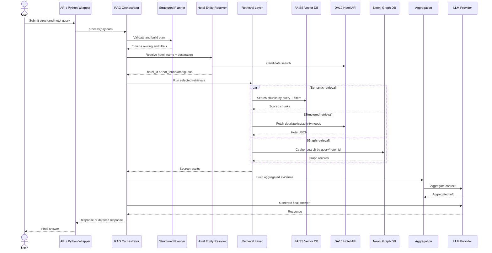
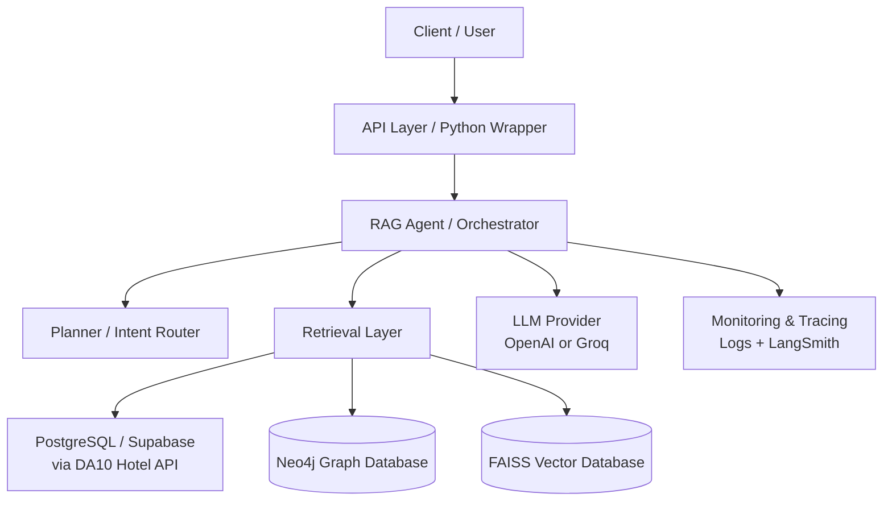
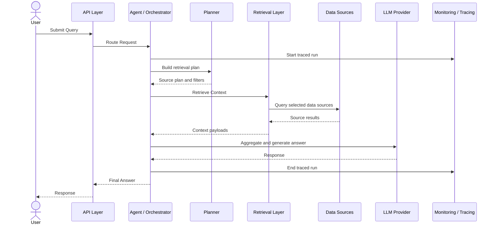
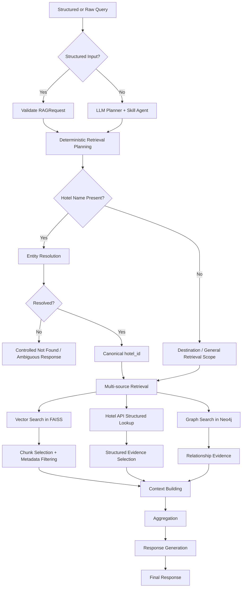
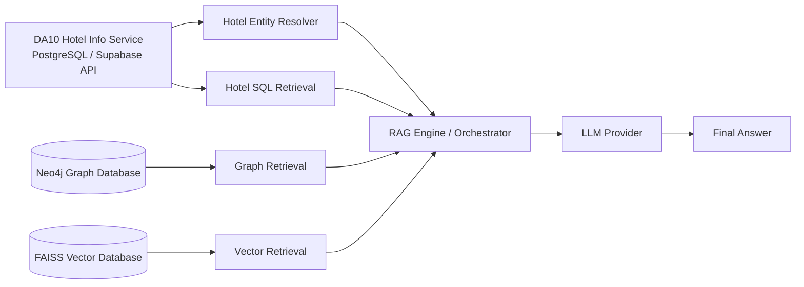

# Tài Liệu Kiến Trúc Hệ Thống

## System Overview

### Mục Tiêu Kinh Doanh

DA09 Smart AI Search Recommendation Assistant là hệ thống RAG cho domain khách sạn. Mục tiêu của hệ thống là hỗ trợ tìm kiếm, truy xuất, so sánh và trả lời câu hỏi về khách sạn dựa trên nhiều nguồn dữ liệu khác nhau.

Hệ thống hướng tới các bài toán chính:

- Trả lời câu hỏi về đặc điểm khách sạn.
- Trả lời câu hỏi về chính sách khách sạn.
- So sánh khách sạn theo điểm đến, tiện ích, chính sách và kỳ vọng chuyến đi.
- Hỗ trợ recommendation dựa trên dữ liệu khách sạn có cấu trúc và ngữ nghĩa.

Active RAG pipeline hiện không sử dụng user profile, short-term memory hoặc dữ liệu hội thoại trước đó làm nguồn retrieval. Thiết kế hiện tại tập trung vào độ chính xác của dữ liệu khách sạn và giảm latency/token cho mỗi request.

### Core Use Cases

- Người dùng hỏi một khách sạn có tiện ích cụ thể hay không.
- Người dùng hỏi chính sách check-in, trẻ em, thú cưng hoặc các rule khác.
- Người dùng so sánh nhiều lựa chọn khách sạn.
- Hệ thống resolve tên khách sạn nhập không chính xác sang canonical `hotel_id`.
- Hệ thống truy xuất evidence từ vector database, Hotel SQL API và graph database.
- Hệ thống tổng hợp context và sinh câu trả lời bằng LLM.
- Engineer chạy smoke test và benchmark để đánh giá chất lượng pipeline.

### Tóm Tắt Kiến Trúc Cấp Cao

Hệ thống là một Python backend xoay quanh RAG orchestrator. Structured input được validate, chuyển thành deterministic plan, sau đó điều phối các nguồn truy xuất phù hợp.

Các nguồn retrieval chính:

- FAISS local vector index cho semantic hotel chunks.
- DA10 Hotel API, đóng vai trò service truy xuất dữ liệu PostgreSQL/Supabase.
- Neo4j graph database cho dữ liệu quan hệ.
- OpenAI hoặc Groq cho LLM generation.
- LangSmith cho tracing.

Các module logging/analytics nếu còn tồn tại trong repository không được tính là retrieval source của RAG.

API HTTP hiện tại còn tối giản. `backend/main.py` khởi tạo FastAPI app, expose root endpoint và chạy Kafka log listener ở background. RAG pipeline hiện được gọi chủ yếu qua Python wrapper/script trong `backend/app/rag`.

## Architecture Principles

### Design Goals

- **Ưu tiên retrieval accuracy:** hệ thống tập trung vào dữ liệu khách sạn thay vì chatbot tổng quát.
- **Structured input first:** input có intent và extracted features giúp giảm LLM planner calls.
- **Multi-source evidence:** câu trả lời có thể kết hợp vector chunks, dữ liệu SQL/API và graph relationships.
- **Entity safety:** tên khách sạn phải được resolve sang canonical `hotel_id` trước khi filter retrieval.
- **Fail-safe behavior:** nếu hotel name `not_found` hoặc `ambiguous`, pipeline dừng để tránh trả lời sai khách sạn.
- **Latency-aware routing:** mỗi intent chỉ gọi các nguồn dữ liệu cần thiết.
- **Observable execution:** các stage quan trọng có logging và LangSmith tracing.

### Scalability Considerations

- FAISS hiện chạy local in-process. Cách này nhanh cho dataset hiện tại nhưng khi scale horizontal, mỗi instance cần có cùng index artifacts.
- DA10 API và Neo4j là remote dependencies, latency phụ thuộc network và giới hạn của service bên ngoài.
- Structured pipeline chạy các retrieval jobs song song bằng thread pool.
- Chưa có distributed cache, queue cho RAG requests hoặc autoscaling manifests.
- `infra/` hiện chỉ là scaffold placeholder.
- Với hotel corpus lớn hơn, cần đánh giá lại index build, index loading, metadata sidecar JSON và chiến lược vector database.

### Reliability Considerations

- DA10 API có retry cho timeout, transport errors và HTTP status có thể retry.
- Entity resolution giúp tránh trả lời sai khách sạn.
- Graph retrieval catch lỗi và trả về list rỗng.
- RAG retrieval catch exception và trả source-level error trong detailed response.
- Lỗi LLM provider được surface trong response.
- Orchestrator chạy sync ở caller level, nhưng structured retrieval có parallelism nội bộ.

### Security Considerations

- Secrets được đọc từ `.env` hoặc environment variables.
- Các secret chính gồm OpenAI, Groq, LangSmith, DA10 OTA API và Neo4j.
- Không được commit key thật lên repository.
- Neo4j dùng basic auth qua HTTP endpoint.
- DA10 API dùng `X-API-Key` khi có cấu hình.
- FastAPI app hiện chưa có RAG endpoint public có authentication.
- Dữ liệu telemetry nếu được bật cần được coi là dữ liệu nhạy cảm nhưng không được dùng để retrieve user profile cho RAG.

## System Components

### FastAPI Backend Entrypoint

**Mục đích:** Khởi tạo backend application và logging infrastructure.

**Trách nhiệm:**

- Tạo FastAPI app.
- Start Kafka log listener trong daemon thread.
- Expose root endpoint dạng health check.

**Dependencies:**

- FastAPI
- `memory_log.conversation_logger`
- Optional telemetry logging components

**Input/Output:**

- Input: HTTP GET `/`
- Output: `{"message": "Still alive"}`

**Giới hạn hiện tại:** Chưa có HTTP endpoint public để gọi RAG pipeline.

### RAG Orchestrator

**Mục đích:** Điều phối planning, entity resolution, retrieval, aggregation và generation.

**Trách nhiệm:**

- Parse structured RAG request.
- Build deterministic retrieval plan.
- Hỗ trợ legacy raw text input bằng LLM planner và skill agent.
- Resolve hotel identity trước khi retrieval.
- Gọi RAG, Graph và Hotel SQL theo plan.
- Tổng hợp evidence.
- Sinh response cuối cùng.
- Trả detailed output khi cần debug.

**Dependencies:**

- `rag_input`
- `modules.planner`
- `modules.skill_agent`
- `modules.retrieval`
- `modules.total_info`
- `modules.generation`
- LangSmith tracer

**Input/Output:**

- Input: structured request dict/object hoặc raw query string.
- Output: response string hoặc detailed dictionary.

### Structured Input Contract

**Mục đích:** Định nghĩa schema input chính và routing logic deterministic.

**Trách nhiệm:**

- Validate intent type.
- Biểu diễn query features: hotel name, destination, amenities, expectations.
- Build retrieval query giàu context hơn.
- Build deterministic plan không dùng LLM.

**Dependencies:**

- Pydantic

**Input/Output:**

Input:

```json
{
  "intent_type": "HOTEL_FEATURE_QA",
  "source": "RAG_SERVICE",
  "parameters": {
    "query": "Pullman Đà Nẵng có hồ bơi không?",
    "features": {
      "hotel_name": "Pullman Danang",
      "destination": "Da Nang",
      "amenities": ["pool"],
      "expectations": ["family_trip"]
    }
  }
}
```

Output:

- `RAGRequest` đã validate.
- Retrieval query string.
- Deterministic plan gồm source requirements, RAG sections và SQL needs.

### Planner Và Skill Agent

**Mục đích:** Hỗ trợ legacy raw text query khi không có structured input.

**Trách nhiệm:**

- Suy luận query type và retrieval requirements từ natural language.
- Route free-form intent sang các nhóm xử lý của RAG.

**Dependencies:**

- LLM client
- Logger
- LangSmith tracer

**Input/Output:**

- Input: raw query string.
- Output: planning dictionary và intent routing metadata.

**Ghi chú:** Structured request bypass LLM planner và skill agent.

### Retrieval Layer

**Mục đích:** Cung cấp interface thống nhất cho các nguồn retrieval.

**Trách nhiệm:**

- Resolve hotel entity bằng Hotel SQL tool.
- Query FAISS vector retrieval.
- Query Neo4j graph search.
- Query DA10 Hotel API.
- Chuẩn hóa source errors thành structured result dictionaries.

**Dependencies:**

- `tools.rag_tool`
- `tools.graph_tool`
- `tools.hotel_sql_tool`
- LangSmith tracer

**Input/Output:**

- Input: query, filters, hotel ID, hotel name, city, SQL needs.
- Output: dictionary có `success`, `source`, `results`, `count`, optional `error`.

### Hotel Entity Resolver

**Mục đích:** Resolve tên khách sạn không hoàn hảo sang canonical hotel ID.

**Trách nhiệm:**

- Normalize text và city.
- Score candidate bằng RapidFuzz WRatio, token-set, token-sort, token coverage, destination match và alias matching.
- Phát hiện `not_found` và `ambiguous`.
- Cache alias đã resolve trong process memory.

**Dependencies:**

- RapidFuzz
- Pydantic
- Candidate từ DA10 API hoặc local FAISS metadata fallback

**Input/Output:**

- Input: hotel name, candidate records, optional city.
- Output: `HotelResolution`.

### Hotel SQL Tool

**Mục đích:** Truy xuất canonical hotel data từ DA10 Hotel API.

**Trách nhiệm:**

- Search candidate hotels từ `/api/hotels`.
- Resolve hotel name sang hotel ID.
- Fetch hotel detail, policies và activities theo requested needs.
- Convert city không dấu sang dạng API nhận có dấu.
- Fallback local metadata khi bounded API search không resolve được.
- Loại nested policy fields trong detail nếu caller không yêu cầu policies.

**Dependencies:**

- DA10 API base URL
- DA10 OTA API key
- `httpx`
- Pydantic
- FAISS metadata sidecar

**Input/Output:**

- Input: `HotelLookupInput`.
- Output: `HotelLookupOutput`.

### FAISS Vector Retrieval Tool

**Mục đích:** Semantic retrieval trên hotel chunks local.

**Trách nhiệm:**

- Load FAISS index từ `data/faiss_hotels.index`.
- Load metadata và chunk sidecars.
- Embed query bằng SentenceTransformer.
- Search FAISS bằng normalized embeddings và inner product.
- Apply metadata filters bằng Python.
- Return scored chunks.

**Dependencies:**

- FAISS
- NumPy
- SentenceTransformers
- Local artifacts:
  - `faiss_hotels.index`
  - `faiss_hotels_meta.json`
  - `faiss_hotels_chunks.json`
  - `faiss_hotels_config.json`

**Input/Output:**

- Input: query, top K, metadata filters.
- Output: chunks gồm score, chunk ID, section, content và metadata.

### Graph Tool

**Mục đích:** Truy xuất facts và relationships từ Neo4j.

**Trách nhiệm:**

- Build Cypher query từ query terms.
- Query Neo4j HTTP transaction endpoint.
- Loại các label không thuộc hotel domain nếu graph có dữ liệu ngoài phạm vi khách sạn.
- Scope theo canonical hotel ID nếu có.
- Return node properties, matched properties, score, labels và relationships.

**Dependencies:**

- Neo4j HTTP endpoint
- Neo4j credentials
- `requests`

**Input/Output:**

- Input: query, top K, optional hotel ID.
- Output: graph records.

### Aggregation Module

**Mục đích:** Gộp evidence từ nhiều nguồn thành intermediate context.

**Trách nhiệm:**

- Chuyển RAG, Graph, SQL và Planner output thành source blocks.
- Truncate context theo character budget.
- Chạy single-pass aggregation cho structured request.
- Chạy multi-pass aggregation cho legacy flow nếu context lớn.

**Dependencies:**

- LLM client
- LangSmith tracer

**Input/Output:**

- Input: query, plan, RAG results, graph results, SQL results.
- Output: aggregation dictionary.

### Generation Module

**Mục đích:** Sinh câu trả lời cuối cùng.

**Trách nhiệm:**

- Build final answer prompt từ query và aggregated information.
- Gọi LLM provider.
- Return user-facing response.

**Dependencies:**

- LLM client
- `LLM_PROVIDER`

**Input/Output:**

- Input: query và aggregated information.
- Output: response string.

### LLM Client

**Mục đích:** Trừu tượng hóa OpenAI và Groq provider.

**Trách nhiệm:**

- Init OpenAI khi `LLM_PROVIDER=openai`.
- Dùng Groq adapter khi `LLM_PROVIDER=groq`.
- Hỗ trợ OpenAI backup key fallback.
- Parse structured output dạng JSON nếu cần.

**Dependencies:**

- OpenAI Python SDK
- Groq Python SDK
- Environment settings

**Input/Output:**

- Input: chat messages, optional system prompt, optional provider.
- Output: response text hoặc parsed JSON dictionary.

### Frontend Scaffold

**Mục đích:** Giữ cấu trúc cho frontend application.

**Trạng thái:** Chỉ có placeholder folders cho chat, product card, search, hooks, pages, services, store và styles. Chưa có implementation hoặc package manifest.

### Infrastructure Scaffold

**Mục đích:** Giữ cấu trúc deployment.

**Trạng thái:** `infra/docker`, `infra/k8s`, `infra/terraform` hiện chỉ có placeholder `.gitkeep`.

## Data Sources

### PostgreSQL / Supabase Qua DA10 Hotel API

Hệ thống không connect trực tiếp PostgreSQL, mà gọi DA10 Hotel API.

Đóng góp:

- Canonical hotel identity.
- Hotel detail.
- Hotel policy.
- Hotel activities.
- Candidate search theo hotel name và city.

### Neo4j Graph Database

Neo4j được gọi qua HTTP transaction endpoint.

Đóng góp:

- Dữ liệu quan hệ giữa hotel, city, room và related entities.
- Evidence cho comparison và query cần relationship.

### FAISS Vector Database

FAISS là local in-process vector index.

Đóng góp:

- Semantic retrieval trên hotel text chunks.
- Section filtering cho description, policy và activities.
- Hotel ID filtering sau entity resolution.

### Local JSON Sidecars

Các sidecars:

- `faiss_hotels_meta.json`
- `faiss_hotels_chunks.json`
- `faiss_hotels_config.json`
- `chunked_hotels_enriched.json`

Đóng góp:

- Metadata filtering.
- Chunk reconstruction.
- Embedding model config.
- Resolver fallback candidates.

### LLM Providers

Hệ thống hỗ trợ OpenAI và Groq.

Đóng góp:

- Legacy planning.
- Skill routing cho raw string input.
- Evidence aggregation.
- Final answer generation.
- Conversation summary generation.

### LangSmith

LangSmith dùng cho tracing các stage quan trọng.

### Kafka

Kafka dùng để vận chuyển logging events bất đồng bộ cho session analytics.

## Request Flow

### End-to-End Request Lifecycle

1. Caller gửi structured RAG request hoặc raw query.
2. API wrapper gọi `chatbot.process`.
3. Structured input được validate bằng Pydantic. Raw input đi qua legacy LLM planner.
4. Hệ thống build retrieval plan.
5. Nếu có hotel name, hệ thống resolve sang canonical hotel ID.
6. Nếu resolution fail hoặc ambiguous, pipeline trả controlled response.
7. Retrieval jobs chạy trên các nguồn được chọn.
8. Source results được aggregate.
9. LLM sinh câu trả lời cuối cùng.
10. Detailed mode trả thêm plan, source outputs, entity resolution và aggregation.

### Request Processing Flow



## Retrieval Architecture

### Retrieval Sources

- **FAISS RAG:** semantic chunk retrieval.
- **DA10 Hotel API:** structured factual hotel data.
- **Neo4j Graph:** relationship retrieval.

User profile và short-term memory retrieval đã được loại khỏi active retrieval path.

### Retrieval Routing Logic

| Intent | RAG | RAG Sections | Hotel SQL Needs | Graph |
|---|---:|---|---|---:|
| `HOTEL_FEATURE_QA` | Có | `description`, `activities` | `detail`, `activities` | Không |
| `HOTEL_POLICY_QA` | Có | `policy` | `policies` | Không |
| `HOTEL_COMPARISON_QA` | Có | `description`, `policy`, `activities` | `detail`, `policies`, `activities` | Có |

### Hybrid Search Strategy

Hệ thống kết hợp:

- Vector semantic search.
- Structured API lookup.
- Graph property/relationship search.
- Entity resolution trước retrieval.

Hiện chưa có learned cross-source reranker. Aggregation layer dùng LLM để gộp evidence.

### Ranking Và Reranking

- FAISS trả vector similarity score.
- Graph search dùng property-match score trong Cypher.
- Entity resolver dùng RapidFuzz scoring.
- Chưa có learning-to-rank model.

## RAG Pipeline

### Query Processing

Structured query được parse thành:

- Intent type.
- Original query.
- Hotel name.
- Destination.
- Amenities.
- Expectations.

Retrieval query được enrich bằng các structured features.

### Chunking Strategy

Repository có sẵn pre-chunked hotel data:

- `chunked_hotels.json`
- `chunked_hotels_enriched.json`
- `faiss_hotels_chunks.json`

Chunks có section như:

- `description`
- `policy`
- `activities`

Metadata gồm hotel ID, hotel name, section, chunk index và tags.

### Embedding Strategy

FAISS config dùng `BAAI/bge-m3`, normalized embeddings và dimension 1024. Query embeddings được sinh bằng SentenceTransformers.

### Context Construction

Context được build từ:

- RAG chunk results.
- Graph records.
- Hotel SQL JSON output.
- Planner context.

Aggregation module truncate context theo character budget trước khi gọi LLM.

### Response Generation

LLM provider sinh câu trả lời cuối cùng từ aggregated information và original query.

## Data Flow Diagrams

### High-Level System Architecture



### Request Processing Flow



### RAG Pipeline Diagram



### Data Flow Diagram



## API Layer

### Public APIs

Đã implement:

- `GET /` trong `backend/main.py`: health-style endpoint.

Chưa implement:

- HTTP endpoint để gọi structured RAG request.
- Authentication middleware.
- OpenAPI schema cho RAG contract.

### Internal APIs

RAG hiện được gọi qua Python API:

- `ChatbotAPI.ask(question)`
- `ChatbotAPI.ask_detailed(question)`
- `chatbot.process(...)`
- `chatbot.chat(query)`

## Infrastructure

### Deployment Architecture

Repository có placeholder cho:

- `infra/docker`
- `infra/k8s`
- `infra/terraform`

Chưa có Dockerfile, Kubernetes manifest, Terraform module hoặc production deployment definition.

### Runtime Dependencies

Các dependency chính:

- Python
- FastAPI
- Pydantic
- OpenAI SDK
- Groq SDK
- LangSmith
- Requests
- HTTPX
- FAISS CPU
- SentenceTransformers
- RapidFuzz
- PyMongo và Kafka cho logging subsystem

### Environment Configuration

Các biến môi trường quan trọng:

- `OPENAI_API_KEY`
- `OPENAI_API_KEY_BACKUP`
- `OPENAI_MODEL`
- `GROQ_API_KEY`
- `GROQ_MODEL`
- `LLM_PROVIDER`
- `LANGSMITH_API_KEY`
- `LANGSMITH_PROJECT`
- `LANGSMITH_TRACING`
- `GRAPH_DB_URL`
- `GRAPH_DB_USER`
- `GRAPH_DB_PASSWORD`
- `GRAPH_DB_DATABASE`
- `DA10_OTA_API_KEY`
- `DA10_API_BASE_URL`
- `MONGO_URI`
- `DATABASE_NAME`
- `KAFKA_URL`

Ghi chú: `VECTOR_DB_URL` có trong env example nhưng vector implementation hiện dùng local FAISS files.

## Monitoring And Observability

### Logging

Các module RAG dùng standard logger theo `LOG_LEVEL`. Logs bao gồm planning, retrieval, aggregation, generation, source errors và initialization.

### Tracing

LangSmith tracing wrap các function chính:

- `rag_system_process`
- `planner`
- `skill_agent_route`
- `resolve_hotel_entity`
- `retrieval_from_rag`
- `retrieval_from_graph`
- `retrieval_from_hotel_sql`
- `tool_rag_search`
- `tool_graph_search`
- `aggregate_information`
- `generate_response`

### Metrics

Hiện có:

- Benchmark JSON ghi latency và source status.
- Kafka events cho latency và TTFT.

Chưa có:

- Prometheus metrics.
- Centralized logging.
- SLO dashboards.

## Security

### Authentication

Đã có:

- DA10 API dùng `X-API-Key`.
- Neo4j dùng username/password.
- LLM providers dùng API keys.
- LangSmith dùng API key.

Chưa có:

- Authentication cho public FastAPI endpoints.
- Authorization theo user/tenant.

### Secrets Management

Secrets hiện được đọc từ env vars và `.env`.

Khuyến nghị production:

- Dùng managed secret store.
- Không commit `.env`.
- Rotate các key từng bị commit hoặc chia sẻ.
- `.env.example` chỉ dùng placeholder.

## Project Structure

```text
DA09_Smart-AI-Search-Recommendation-Assistant/
├── backend/
│   ├── main.py
│   ├── memory_log/
│   └── app/rag/
│       ├── rag_system.py
│       ├── rag_input.py
│       ├── rag_output.py
│       ├── run.py
│       ├── config/
│       ├── data/
│       ├── modules/
│       ├── scripts/
│       ├── smoke_test/
│       ├── tools/
│       └── utils/
├── frontend/
├── infra/
├── docs/
├── data/
├── notebooks/
└── scripts/
```

### Trách Nhiệm Các Folder Chính

- `backend/`: backend Python, telemetry logging và RAG.
- `backend/app/rag/`: core RAG application.
- `backend/app/rag/modules/`: planner, retrieval, aggregation, generation.
- `backend/app/rag/tools/`: source adapters và entity resolver.
- `backend/app/rag/data/`: local chunks, FAISS index và metadata.
- `backend/app/rag/scripts/`: data enrichment và FAISS index build scripts.
- `backend/app/rag/smoke_test/`: smoke tests, benchmarks và benchmark results.
- `backend/memory_log/`: telemetry logging và analytics, nằm ngoài RAG retrieval.
- `frontend/`: frontend scaffold.
- `infra/`: infrastructure scaffold.

## Future Improvements

### Technical Debt

- Thêm FastAPI endpoint thật cho structured RAG request.
- Giữ telemetry tách biệt khỏi RAG retrieval; nếu tái bật personalization cần thiết kế contract riêng thay vì ghép vào pipeline hiện tại.
- Sửa các chuỗi mojibake trong prompt/comment/city mappings.
- Xóa hoặc hợp nhất file RAG system trùng nếu không còn dùng.
- Cải thiện benchmark status để source-level failure không bị tính là success.
- Thêm tests cho SQL need routing.
- Thêm deterministic context pruning trước aggregation/generation.

### Scaling Opportunities

- Chuyển sang managed vector database nếu local FAISS không còn phù hợp.
- Cache entity resolution cross-process.
- Cache DA10 API response theo hotel ID.
- Chuyển orchestration sang async end-to-end.
- Thêm circuit breaker cho external sources.

### Architectural Recommendations

- Xem structured input là production contract chính.
- Thêm versioned RAG HTTP API.
- Thêm field source needs để prune SQL output theo intent.
- Bỏ LLM aggregation cho simple single-hotel feature/policy QA.
- Thêm health checks cho DA10 API, Neo4j, FAISS artifacts, LLM providers và logging subsystem nếu được bật.
- Thêm production infrastructure manifests khi target runtime rõ ràng.
