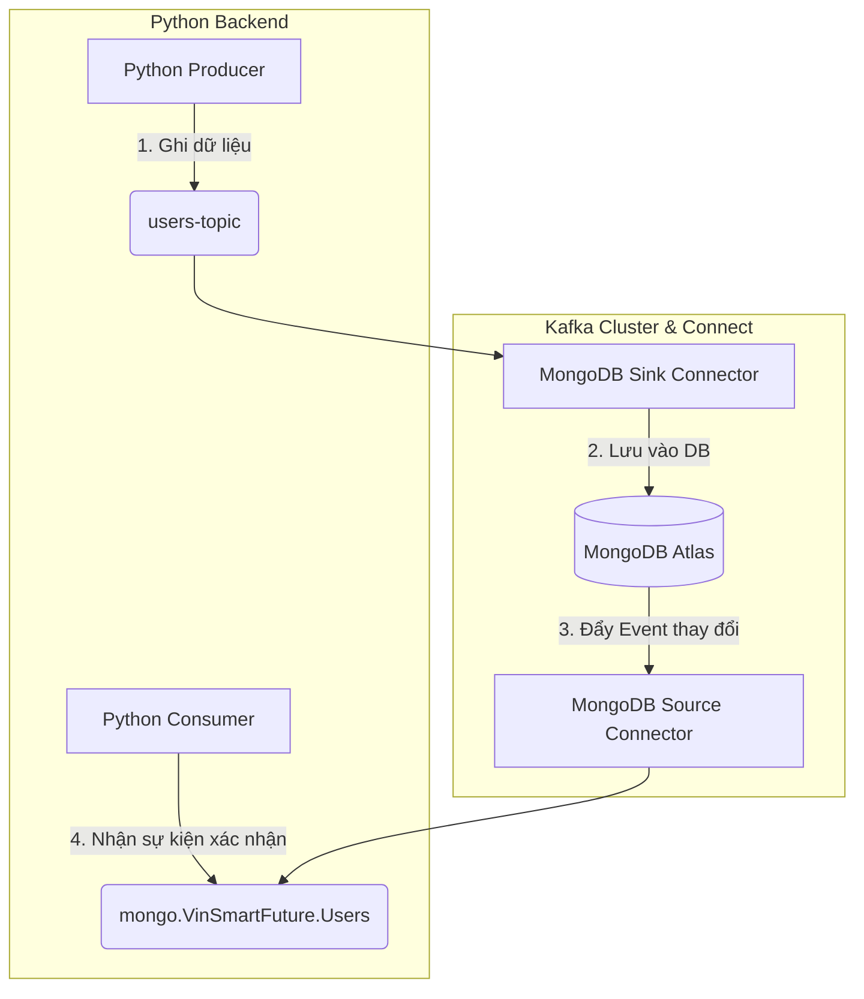

# Tài liệu hướng dẫn kết nối cơ sở dữ liệu MongoDB thông qua Kafka bằng Python

Để tương tác với Cơ sở dữ liệu MongoDB thông qua Kafka bằng Python, cần xây dựng theo kiến trúc **Event-Driven (Hướng sự kiện)**. 

Dưới đây là sơ đồ luồng hoạt động và mã nguồn mẫu chi tiết cho cả hai chiều **Ghi (Write)** và **Đọc (Read)** kèm cơ chế xác nhận tương đương với Webhook.

---

## 1. Mô hình kiến trúc tương tác



### Cách hoạt động:
1.  **Ghi dữ liệu (Write):** Python Backend gửi bản ghi JSON vào Kafka topic `users-topic`.
2.  **Đồng bộ tự động:** Kafka Connect (Sink) nhận bản tin này và lưu vào MongoDB.
3.  **Webhook báo thành công (Database-level):** Khi MongoDB lưu thành công, MongoDB Source Connector sẽ phát hiện sự thay đổi và đẩy một event vào topic `mongo.VinSmartFuture.Users`. Python Backend lắng nghe topic này để nhận xác nhận (tương tự Webhook).
4.  **Đọc dữ liệu (Read):** 
    *   *Đọc thời gian thực (Streaming):* Lắng nghe các event từ topic `mongo.VinSmartFuture.Users`.
    *   *Đọc truy vấn (Query):* Đọc trực tiếp từ MongoDB Atlas bằng thư viện `pymongo` (Mô hình CQRS - Tách biệt ghi và đọc).

---

## 2. Hướng dẫn cài đặt & Code Python mẫu

Cài đặt thư viện cần thiết trên môi trường Python:
```bash
pip install confluent-kafka pymongo
```

### Tệp 1: Ghi dữ liệu (Python Producer)
Tệp này gửi dữ liệu vào Kafka và nhận phản hồi (Callback) khi Kafka đã nhận tệp thành công.

```python
# producer.py
from confluent_kafka import Producer
import json

# Cấu hình kết nối tới Kafka Broker (Dùng cổng EXTERNAL)
conf = {
    'bootstrap.servers': 'ip_server:port_external', 
    'client.id': 'python-backend-producer'
}

producer = Producer(conf)

# Callback chạy khi Kafka Broker phản hồi đã nhận dữ liệu
def delivery_report(err, msg):
    if err is not None:
        print(f"[-] Gửi tin nhắn thất bại: {err}")
    else:
        print(f"[+] Đã ghi vào Kafka thành công! Topic: {msg.topic()} | Partition: [{msg.partition()}]")

def create_user(user_data):
    # Chuyển đổi sang JSON string
    payload = json.dumps(user_data)
    
    # Gửi dữ liệu vào topic 'users-topic'
    producer.produce(
        topic='users-topic', 
        value=payload, 
        callback=delivery_report
    )
    
    # Đợi gửi xong toàn bộ hàng đợi
    producer.flush()

if __name__ == '__main__':
    # Tạo thử 1 user mới
    new_user = {
        "id": 2002, 
        "name": "Tran Van B", 
        "email": "b.tran@vinsmartfuture.com", 
        "role": "Manager"
    }
    print("[...] Đang gửi dữ liệu user sang Kafka...")
    create_user(new_user)
```

---

### Tệp 2: Webhook lắng nghe phản hồi từ DB (Python Consumer)
Tệp này đóng vai trò như một Webhook lắng nghe sự kiện MongoDB Atlas cập nhật thành công (qua Change Streams của Source Connector).

```python
# db_webhook_listener.py
from confluent_kafka import Consumer, KafkaError
import json

conf = {
    'bootstrap.servers': 'ip_server:port_external',
    'group.id': 'webhook-notification-group',
    'auto.offset.reset': 'latest'
}

consumer = Consumer(conf)

# Subscribe vào topic Change Stream của bảng Users
# Định dạng mặc định của MongoDB Source Connector: prefix.Database.Collection
consumer.subscribe(['mongo.VinSmartFuture.Users'])

print("[*] Webhook Listener đang chạy, đợi sự kiện lưu DB thành công...")

try:
    while True:
        msg = consumer.poll(timeout=1.0)
        if msg is None:
            continue
        if msg.error():
            if msg.error().code() == KafkaError._PARTITION_EOF:
                continue
            else:
                print(f"Lỗi: {msg.error()}")
                break

        # Giải mã dữ liệu thay đổi từ MongoDB gửi lên Kafka
        event_data = json.loads(msg.value().decode('utf-8'))
        
        # Phân tích loại hành động (insert, update, delete)
        operation_type = event_data.get("operationType")
        document_key = event_data.get("documentKey")
        full_document = event_data.get("fullDocument")

        if operation_type == "insert":
            print(f"\n[WEBHOOK SUCCESS] Phát hiện thêm mới bản ghi thành công vào MongoDB!")
            print(f"   - ID bản ghi: {document_key}")
            print(f"   - Chi tiết: {json.dumps(full_document, indent=2)}")
            
        elif operation_type == "update":
            print(f"\n[WEBHOOK SUCCESS] Phát hiện cập nhật bản ghi trong MongoDB!")
            print(f"   - Chi tiết thay đổi: {json.dumps(event_data.get('updateDescription'), indent=2)}")

except KeyboardInterrupt:
    pass
finally:
    consumer.close()
```