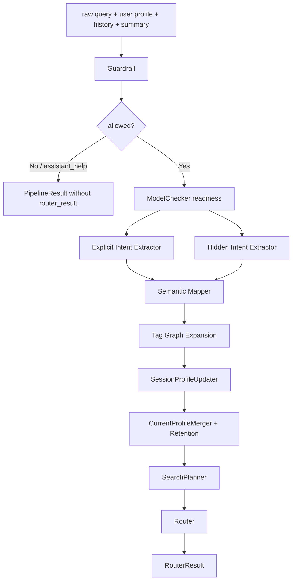
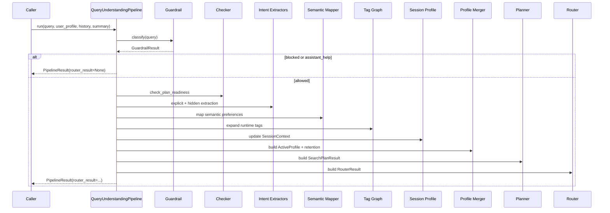

# 00 - Tổng Quan Query Understanding

## Mục tiêu

Cung cấp bức tranh kiến trúc cho phần Query Understanding, bắt đầu từ raw query và kết thúc tại `RouterResult`.

Wiki này không mô tả runtime sau router hoặc các contract vận hành/API của hệ thống bên ngoài Query Understanding.

## Phạm vi sở hữu



## Output cuối của phần này

`QueryUnderstandingPipeline.run(...)` trả về:

```python
PipelineResult(
    trace=PipelineTrace(...),
    router_result=RouterResult(...) | None,
    updated_user_profile=UserProfile(...),
    active_profile=ActiveProfile(...) | None,
)
```

Ý nghĩa:

- `trace`: dữ liệu debug đầy đủ cho các stage QU.
- `router_result`: kế hoạch bàn giao downstream; `None` khi bị guardrail/assistant-help/thiếu thông tin.
- `updated_user_profile`: profile đã cập nhật session context và retention.
- `active_profile`: profile runtime đã merge, dùng để build kế hoạch downstream.

## Runtime sequence



## Ranh giới với hệ thống khác

Query Understanding quyết định:

- Query có được xử lý tiếp hay không.
- Có cần hỏi thêm thông tin hay không.
- Intent/entity/preference nào được extract.
- Tag/profile/session context được cập nhật ra sao.
- Search tasks nào nên được downstream xử lý.

Query Understanding không quyết định cách các module sau router thực thi, chấm điểm, hiển thị hoặc trả payload cuối cho frontend.

## Mapping source code

- Pipeline: backend/app/query_understanding/pipeline.py
- Models: backend/app/query_understanding/models
- Guardrail: backend/app/query_understanding/guardrail
- Intent extraction: backend/app/query_understanding/intent
- Session profile update: backend/app/query_understanding/session_profile
- Profile merge/retention: backend/app/query_understanding/merger
- Planner: backend/app/query_understanding/planner
- Router: backend/app/query_understanding/router
