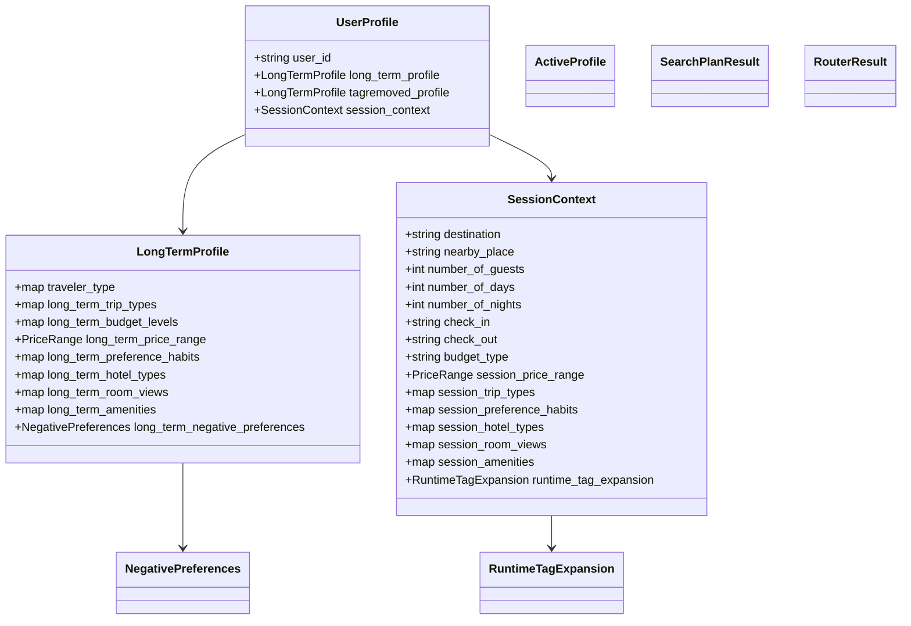

# 01 - Domain Model

## Mục tiêu

Mô tả các data model cốt lõi được dùng bên trong Query Understanding, từ intent extraction đến router output.

## Nhóm model Intent

```python
SemanticPreferenceItem
SemanticPreferenceSet
MappedSemanticItem
SemanticMappingResult
EntitySet
ConstraintSet
IntentResult
```

`EntitySet` chứa các entity trực tiếp từ query:

- `destination`
- `hotel_name`
- `budget_min`, `budget_max`, `budget_scope`, `budget_type`
- `trip_type`
- `nearby_place`
- `number_of_guests`
- `number_of_days`, `number_of_nights`
- `check_in`, `check_out`

`ConstraintSet` chứa constraint phụ trợ:

- `budget_level`
- `location_hint`
- `note_amenities`

## Nhóm model Planner và Profile

```python
CountInteractionValue
PriceRange
NegativePreferences
RuntimeTag
RuntimeTagExpansion
LongTermProfile
SessionContext
UserProfile
SessionProfileUpdateResult
ActiveProfile
SearchPlanResult
```

Quan hệ chính:



## Ý nghĩa score map

`CountInteractionValue` lưu:

- `count`: frequency signal
- `last_interaction`: recency timestamp dạng ISO date

Quy tắc merge phổ biến:

$$
count_k = count^{old}_k + count^{new}_k
$$

$$
last\_interaction_k = \max(last^{old}_k, last^{new}_k)
$$

Khi thêm key mới:

```python
CountInteractionValue(count=1, last_interaction=today)
```

## RuntimeTagExpansion

`RuntimeTagExpansion` tách ba lớp tag:

- `mapped_tags`: tag trực tiếp từ semantic mapper.
- `expanded_tags`: tag liên quan từ Neo4j graph.
- `final_tags`: danh sách hợp nhất sau dedupe.

Dedupe key:

```python
key = (tag.tag, tag.category)
```

## Nhóm model Router và Guardrail

```python
GuardrailResult
ToolCall
RagExecutionStep
ExecutionStep
RouterResult
```

`RouterResult` là output cuối của Query Understanding:

```python
RouterResult(
    execution_mode="parallel",
    rag_plan=[...],
    recommendation_plan=[...],
    tool_calls=[],
)
```

Router chỉ build plan. Nó không thực thi RAG, hotel search, rerank hay response builder.

## Mapping source code

- backend/app/query_understanding/models/intent.py
- backend/app/query_understanding/models/planner.py
- backend/app/query_understanding/models/router.py
- backend/app/query_understanding/models/guardrail.py
