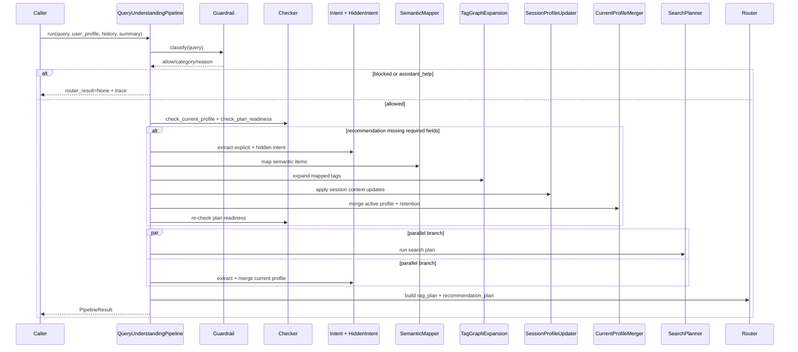

# 02 - Query Understanding Pipeline

## Mục tiêu

Giải thích các stage trong `QueryUnderstandingPipeline`, logic cập nhật profile, và các công thức extract/normalize quan trọng. Pipeline này kết thúc ở `RouterResult`.

## Trình tự runtime chính



## Logic từng stage

### 1) Guardrail

- Chạy đầu tiên.
- Nếu bị block hoặc là assistant-help thì trả về sớm.
- Không tạo `RouterResult`.
- Không update profile bằng nội dung bị block.

Đọc chi tiết: [03-guardrail-and-assistant-help.md](03-guardrail-and-assistant-help.md)

### 2) Plan readiness

Checker quyết định query có cần recommendation plan không và có đủ điều kiện tối thiểu chưa.

Contract hiện tại:

```python
missing_fields = []
if not session.destination:
    missing_fields.append("destination")
```

`destination` là required field chính cho recommendation path. Các field như ngày, số khách, budget giúp downstream tốt hơn nhưng không bắt buộc để build plan.

Nếu query không cần recommendation, ví dụ factual/policy/hotel-info, checker có thể cho `can_build_plan=True` dù thiếu destination.

Nếu query là follow-up có dấu hiệu sửa ngày, số đêm, budget hoặc số khách trong session đã có recommendation context, checker ép `requires_recommendation=True`.

### 3) Explicit extraction và hidden intent

- Explicit extractor lấy entity/preference thể hiện trực tiếp.
- Hidden extractor chỉ chạy khi hidden gate cho phép.
- Hidden result chỉ được tạo từ evidence trong current query, không dựa riêng vào history/profile cũ.

Đọc chi tiết: [04-intent-extraction-and-hidden-intent.md](04-intent-extraction-and-hidden-intent.md)

### 4) Semantic mapping và tag expansion

- Semantic item được map sang tag/category chuẩn hóa bằng FAISS.
- Tag graph expansion bổ sung tag liên quan từ Neo4j.
- Explicit và hidden mapping được gộp theo dedupe key:

```python
key = (matched_tag or text, matched_category or category, target_field)
```

Đọc chi tiết: [05-semantic-mapping-and-tag-expansion.md](05-semantic-mapping-and-tag-expansion.md)

### 5) Session profile update

Entity updates:

- `destination`
- `nearby_place`
- `number_of_guests`
- `number_of_days`, `number_of_nights`
- `check_in`, `check_out`
- `trip_type`
- `budget_type`
- `raw_budget_min`, `raw_budget_max`
- `session_price_range`
- `session_budget_levels`

Tag updates:

- `session_preference_habits`
- `session_hotel_types`
- `session_room_views`
- `session_amenities`
- `session_trip_types`

### 6) Active profile merge và retention

- `ActiveProfile` được merge từ long-term profile, session updates và hidden signals.
- Retention resolver quyết định feature nằm trong active long-term profile hay tagremoved.

Đọc chi tiết: [06-profile-retention.md](06-profile-retention.md)

### 7) Planner + router

- Search planner trả về `SearchPlanResult`.
- Router chuyển search tasks thành `RouterResult`.
- Đây là điểm kết thúc của phạm vi Query Understanding.

Đọc chi tiết: [07-router-contract.md](07-router-contract.md)

## Công thức budget window

Bucketed ratio by extracted budget value $v$:

$$
r(v)=
\begin{cases}
0.50, & v < 1{,}500{,}000 \\
0.40, & 1{,}500{,}000 \le v < 3{,}000{,}000 \\
0.30, & 3{,}000{,}000 \le v < 5{,}000{,}000 \\
0.25, & 5{,}000{,}000 \le v < 10{,}000{,}000 \\
0.20, & v \ge 10{,}000{,}000
\end{cases}
$$

Truy vấn cận trên, ví dụ “dưới X”:

$$
[min,max] = [X(1-r), X]
$$

Truy vấn cận dưới, ví dụ “trên X”:

$$
[min,max] = [X, X(1+r)]
$$

Truy vấn gần đúng, ví dụ “khoảng X”:

$$
[min,max] = [X(1-r), X(1+r)]
$$

## Effective per-night budget

Nếu `budget_type = total` và `number_of_nights > 0`:

$$
min_{night} = \frac{min_{total}}{nights}, \quad max_{night} = \frac{max_{total}}{nights}
$$

Nếu không, effective range bằng raw range.

## Duration normalization

- Nếu extract được days nhưng thiếu nights: `nights = days - 1`
- Nếu extract được nights nhưng thiếu days: `days = nights + 1`
- Nếu thiếu nights nhưng có `check_in/check_out`: `nights = (check_out - check_in).days`

## Score map update

Với mỗi tag key $k$ được tác động:

$$
count_k \leftarrow count_k + w
$$

Với trọng số mặc định $w = 1$ và `last_interaction = today`.

## Ranh giới sau router

Pipeline này không mô tả các module thực thi sau router, payload cuối cho frontend, hay vận hành hệ thống bên ngoài Query Understanding.

## Mapping source code

- backend/app/query_understanding/pipeline.py
- backend/app/query_understanding/checker/model_checker.py
- backend/app/query_understanding/session_profile/updater.py
- backend/app/query_understanding/merger/current_profile_merger.py
- backend/app/query_understanding/merger/profile_retention_resolver.py
- backend/app/query_understanding/planner/planner.py
- backend/app/query_understanding/router/router.py
