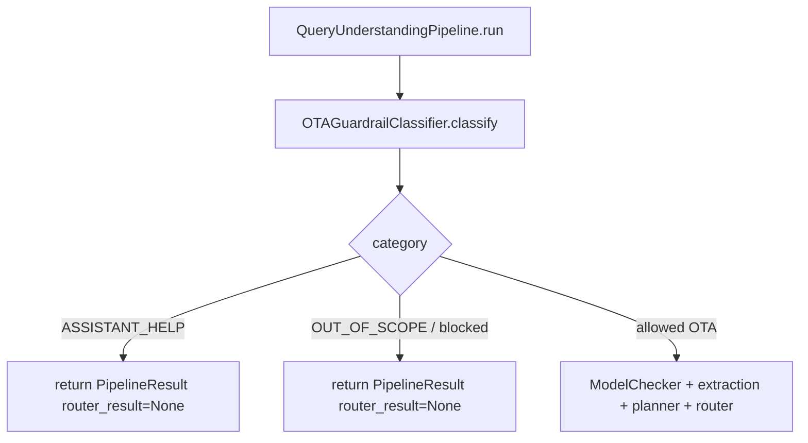

# 03 - Guardrail và Assistant Help

## Mục tiêu

Mô tả lớp phân loại đầu vào của Query Understanding và cách pipeline trả về sớm khi query không nên đi tiếp vào extraction/planner/router.

Tài liệu này chỉ dừng ở `PipelineResult`. Cách agent/API tạo câu trả lời cuối cùng cho user thuộc phạm vi module khác.

## Vị trí runtime



Guardrail chạy trước mọi bước:

- readiness check
- explicit intent extraction
- hidden intent extraction
- semantic mapping
- tag graph expansion
- session profile update
- profile retention
- planner/router

## GuardrailResult contract

```python
GuardrailResult(
    allow: bool,
    category: str,
    reason: str = "",
    assistant_help_context_mode: str = "NONE",
)
```

Các category quan trọng:

- `ASSISTANT_HELP`: người dùng hỏi về trợ lý, chào hỏi, cảm ơn, hoặc hỏi lại ngữ cảnh đã nhớ.
- `OUT_OF_SCOPE`: câu hỏi nằm ngoài phạm vi OTA/hotel/travel mà hệ thống hỗ trợ.
- allowed OTA category: tiếp tục vào checker, extraction, planner, router.

`assistant_help_context_mode`:

- `NO_HISTORY`: câu hỏi assistant-help không cần lịch sử.
- `USE_HISTORY_SUMMARY`: người dùng hỏi về ngữ cảnh đã nhớ, guardrail cho phép downstream caller dùng summary/history.
- `NONE`: không có nhu cầu dùng history.

## Early return: ASSISTANT_HELP

Pipeline trả về sớm:

```python
PipelineResult(
    trace=PipelineTrace(
        guardrail=asdict(guardrail_result),
        checker={
            "assistant_help": True,
            "assistant_capability": guardrail_result.assistant_help_context_mode == "NO_HISTORY",
            "classification": "assistant_help",
        },
        intent={},
        search_plan={},
        router={},
    ),
    router_result=None,
    updated_user_profile=user_profile,
    active_profile=None,
)
```

Không chạy:

- explicit intent extractor
- hidden intent extractor
- semantic mapper
- tag graph expansion
- session profile updater
- current profile merger
- search planner
- router

## Early return: blocked / OUT_OF_SCOPE

Pipeline trả về:

```python
PipelineResult(
    trace=PipelineTrace(
        guardrail=asdict(guardrail_result),
        checker={},
        intent={},
        search_plan={},
        router={},
    ),
    router_result=None,
    updated_user_profile=user_profile,
    active_profile=None,
)
```

Không mutate profile theo query bị chặn.

## Trace fields cần quan tâm

Trong `PipelineTrace`:

- `guardrail.allow`
- `guardrail.category`
- `guardrail.reason`
- `guardrail.assistant_help_context_mode`
- `llm_traces.guardrail`
- `checker.assistant_help`
- `checker.assistant_capability`

## Failure modes thuộc QU

- Capability/social query bị phân loại nhầm là `OUT_OF_SCOPE`: pipeline không tạo plan cho query đáng ra là assistant-help.
- OTA query bị false block: downstream không nhận được router plan.
- Out-of-scope query bị allow nhầm: extraction/profile update có thể bị nhiễu bởi nội dung không thuộc domain.
- Assistant-help hỏi memory nhưng `assistant_help_context_mode` không phải `USE_HISTORY_SUMMARY`: caller không biết có thể dùng summary/history.

## Mapping source code

- backend/app/query_understanding/guardrail/classifier.py
- backend/app/query_understanding/guardrail/prompts.py
- backend/app/query_understanding/guardrail/schema.py
- backend/app/query_understanding/models/guardrail.py
- backend/app/query_understanding/pipeline.py
