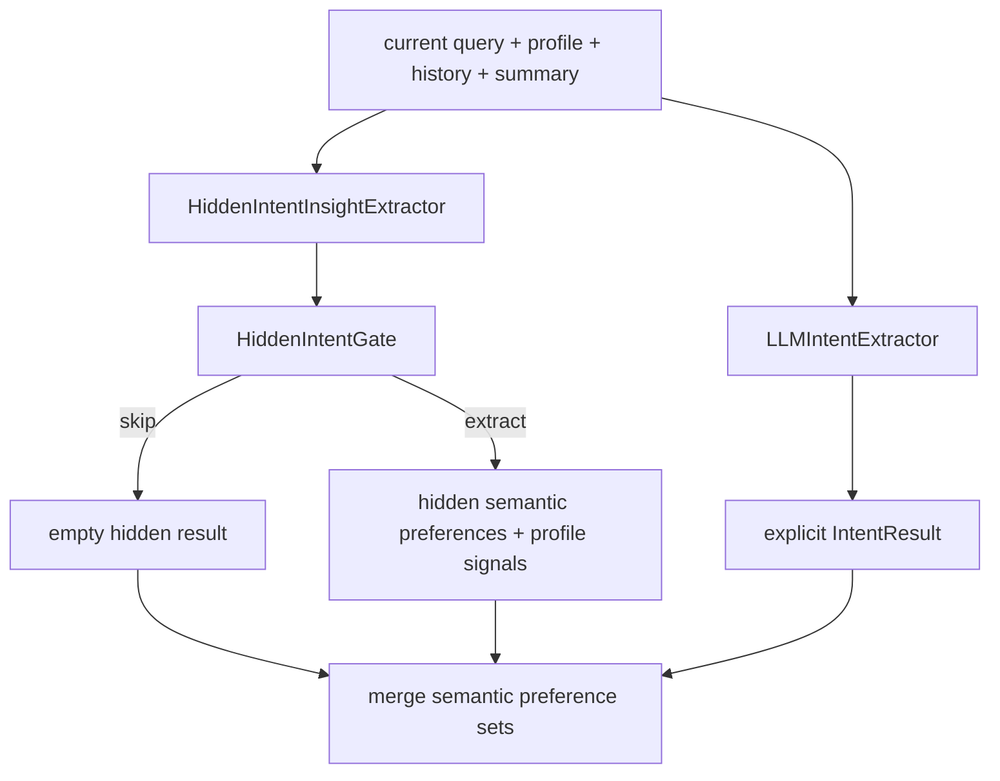

# 04 - Intent Extraction và Hidden Intent

## Mục tiêu

Giải thích cách hệ thống lấy thông tin trực tiếp từ query, cách suy luận tín hiệu ngầm, và cách hai nguồn này được hợp nhất trước semantic mapping/profile update.

## Hai lớp extraction



## Explicit IntentResult

Explicit extractor tạo:

- `intent_components`: nhãn thành phần intent.
- `entities`: destination, hotel_name, budget, dates, guests, trip type, nearby place.
- `semantic_preferences`: các phrase cần map sang tag chuẩn.
- `constraints`: budget level, location hint, note amenities.

Các entity quan trọng:

```python
EntitySet(
    destination=None,
    hotel_name=None,
    budget_min=None,
    budget_max=None,
    budget_scope=None,
    budget_type=None,
    trip_type=None,
    nearby_place=None,
    number_of_guests=None,
    number_of_days=None,
    number_of_nights=None,
    check_in=None,
    check_out=None,
)
```

## Hidden intent gate

Hidden extraction không chạy mọi query. Trước tiên hệ thống gọi gate để giảm nhiễu profile.

Gate decisions:

- `SKIP_SLOT_ONLY`: query chỉ điền slot như destination, dates, budget, guests.
- `SKIP_FACTUAL_RAG`: query hỏi factual/policy/hotel info, không có soft preference mới.
- `SKIP_NO_HIDDEN_VALUE`: explicit extraction đã đủ hoặc tín hiệu quá yếu.
- `EXTRACT_HIDDEN_INTENT`: query có preference/persona/trip purpose mới đáng giữ.

Điều kiện bắt buộc:

- `current_query` là evidence chính.
- Không dùng history/profile cũ làm lý do duy nhất để extract.
- Nếu không chắc, ưu tiên skip.

## HiddenIntentResult

```python
HiddenIntentResult(
    semantic_preferences=SemanticPreferenceSet(...),
    profile_signals=[
        HiddenProfileSignal(
            group="long_term_preference_habits",
            value="quiet",
            confidence=0.8,
            evidence="muốn yên tĩnh",
            source="query",
        )
    ],
)
```

Giới hạn:

- `MAX_SEMANTIC_PREFERENCES = 5`
- `MAX_PROFILE_SIGNALS = 3`
- `confidence >= HIDDEN_INTENT_MIN_CONFIDENCE`

Nhóm `profile_signals` hợp lệ:

- `traveler_type`: `Explorer`, `Comfort seeker`, `Planer`, `Spontaneous`
- `long_term_budget_levels`: `low`, `medium`, `high`
- `long_term_preference_habits`: `luxury`, `comfort`, `quiet`, `privacy`, `unique`, `safety`, `vibrant`

## Heuristic budget level trong hidden intent

Hidden intent không tạo numeric price range, chỉ có thể tạo budget level:

$$
budget\_level =
\begin{cases}
low, & price < 2{,}000{,}000 \\
medium, & 2{,}000{,}000 \le price \le 5{,}000{,}000 \\
high, & price > 5{,}000{,}000
\end{cases}
$$

Nếu explicit extractor đã có `session_budget_levels`, hidden budget signal không được merge để tránh ghi đè tín hiệu trực tiếp.

## Merge explicit và hidden semantic mapping

Sau khi explicit và hidden semantic preferences được map, pipeline merge theo key:

```python
key = (matched_tag or text, matched_category or category, target_field)
```

Item trùng key bị bỏ qua, explicit được duyệt trước hidden nên explicit có quyền ưu tiên tự nhiên.

## Special policy: WiFi tính phí

Hidden mapping có logic tránh suy luận sai `WiFi tính phí`.

Nếu mapper match `wifi tinh phi`, pipeline chỉ giữ tag này khi evidence có cue trả phí:

- `tính phí`
- `trả phí`
- `phụ phí`
- `paid`
- `fee`

Nếu query chỉ nói WiFi/internet/kết nối/mạng, tag được normalize sang `WiFi miễn phí`.

## Trace cần xem khi debug

- `llm_traces.intent`
- `llm_traces.hidden_intent.gate_decision`
- `llm_traces.hidden_intent.normalized`
- `intent.semantic_preferences`
- `session_profile_update.semantic_mapping`

## Mapping source code

- backend/app/query_understanding/intent/extractor.py
- backend/app/query_understanding/intent/hidden_extractor.py
- backend/app/query_understanding/models/intent.py
- backend/app/query_understanding/pipeline.py
