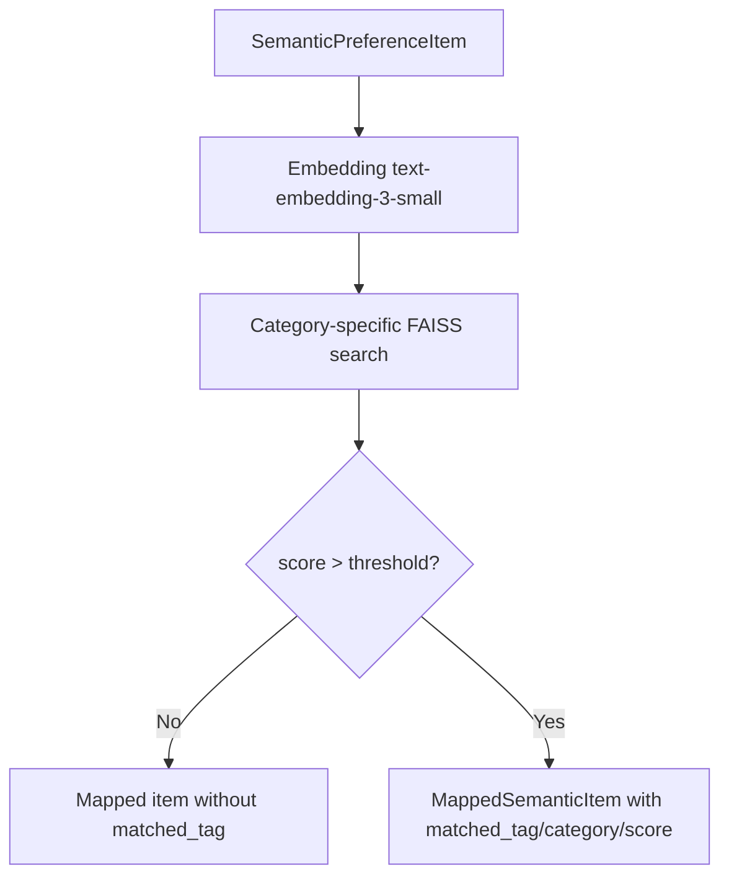
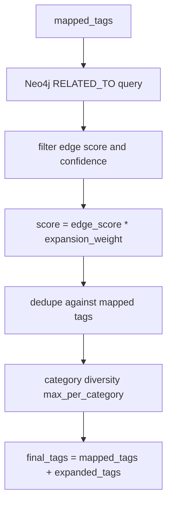

# 05 - Semantic Mapping và Tag Graph Expansion

## Mục tiêu

Mô tả cách phrase tự nhiên từ intent được map sang tag chuẩn, cách Neo4j mở rộng tag liên quan, và cách các tag cuối cùng được route vào session profile.

## Semantic mapping bằng FAISS



Input:

```python
SemanticPreferenceItem(
    text="gần biển",
    target_field="nearby_place",
    category="PLACE_TYPE",
    priority="soft",
)
```

Output:

```python
MappedSemanticItem(
    text="gần biển",
    target_field="nearby_place",
    category="PLACE_TYPE",
    matched_category="PLACE_TYPE",
    matched_tag="Bãi biển",
    score=0.83,
    priority="soft",
)
```

## Config semantic mapper

| Config | Ý nghĩa |
| --- | --- |
| `QU_TAG_INDEX_PATH` | Path FAISS index tag |
| `QU_TAG_METADATA_PATH` | Path metadata JSON của tag |
| `SEMANTIC_SCORE_THRESHOLD` | Ngưỡng nhận match |
| `SEMANTIC_TOP_K` | Số candidate tối đa lấy từ index |
| `SEMANTIC_CLOSE_SCORE_DELTA` | Giữ thêm match gần best score |
| `QU_SEMANTIC_KEEP_CLOSE_MATCHES` | Cho phép nhiều match gần nhau thay vì chỉ best match |

Selection mặc định:

```python
selected = [best_candidate] if best_score > score_threshold else []
```

Nếu `keep_close_matches=true`:

$$
selected = \{c_i \mid score_i > threshold \land best\_score - score_i \le close\_delta\}
$$

## Category fallback

Mapper không search mọi category cho mọi item. Chỉ có fallback hẹp:

- `ROOM_VIEW` search trong `ROOM_VIEW`, sau đó `REVIEW_TAG`
- `REVIEW_TAG` search trong `REVIEW_TAG`, sau đó `ROOM_VIEW`
- category khác chỉ search chính nó

Mục tiêu là bắt được các phrase như “view đẹp”, “hướng biển”, nhưng không làm nhiễu hotel type/amenity.

## Fallback khi index lỗi

Nếu thiếu dependency, thiếu index/metadata, thiếu API key, hoặc embedding lỗi:

- vẫn trả `MappedSemanticItem` cho từng input
- `matched_tag=None`
- `score=None`
- trace ghi `status=index_unavailable` hoặc `embedding_error`

Graph vẫn tiếp tục chạy. Session updater có thể dùng text gốc trong vài trường hợp như `nearby_place`.

## Tag graph expansion bằng Neo4j



Cypher logic:

```cypher
MATCH (src:Tag {name: mapped_tag.tag, category: mapped_tag.category})
MATCH (src)-[r:RELATED_TO]->(dst:Tag)
WHERE r.score >= $min_edge_score
  AND r.confidence >= $min_confidence
RETURN dst.name, dst.category, r.score, r.confidence
```

Expansion score:

$$
expanded\_score = edge\_score \times expansion\_weight
$$

## Config tag expansion

| Config | Ý nghĩa |
| --- | --- |
| `NEO4J_URI` | Neo4j URI |
| `NEO4J_USER` | User |
| `NEO4J_PASSWORD` | Password |
| `NEO4J_DATABASE` | Database |
| `MIN_MAPPING_SCORE` | Mapped tag phải vượt ngưỡng này mới được expand |
| `MIN_EDGE_SCORE` | Edge `RELATED_TO.score` tối thiểu |
| `MIN_CONFIDENCE` | Edge confidence tối thiểu |
| `MAX_PER_CATEGORY` | Giới hạn số expanded tags mỗi category |
| `EXPANSION_WEIGHT` | Hệ số nhân score từ graph |

## Transient vs non-transient graph error

Transient error:

- connection/network timeout
- service unavailable
- session expired

Hành vi: fallback về mapped tags, không fail request.

Non-transient error:

- auth/config/cypher/schema error

Hành vi: raise exception để lộ lỗi cấu hình hoặc dữ liệu graph sai.

## Route tag vào session profile

`TagSessionRouter` route theo category:

| Category | Session field |
| --- | --- |
| `SUITABLE_FOR` | `session_trip_types` |
| `ROOM_VIEW` | `session_room_views` |
| `REVIEW_TAG` | `session_preference_habits` |
| `HOTEL_TYPE` | `session_hotel_types` |
| `HOTEL_AMENITY` | `session_amenities` |
| `ROOM_AMENITY` | `session_amenities` |

Một số `REVIEW_TAG` giống amenity cũng được đưa thêm vào `session_amenities` qua `AMENITY_LIKE_REVIEW_TAGS`.

## Dedupe rule

Runtime tag dedupe dùng key:

```python
key = (tag.tag, tag.category)
```

Mapped tags được giữ trước expanded tags. Expanded tag trùng mapped tag bị bỏ.

## Mapping source code

- backend/app/query_understanding/intent/semantic_mapper.py
- backend/app/query_understanding/intent/tag_graph_expander.py
- backend/app/query_understanding/session_profile/updater.py
- backend/app/query_understanding/config/settings.py
