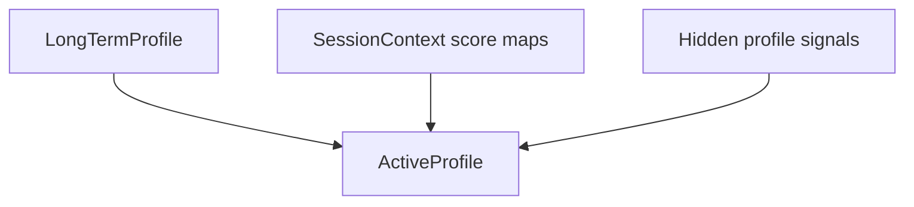

# 06 - Profile Retention

## Mục tiêu

Giải thích cách Query Understanding merge session context, active profile, long-term profile và tagremoved profile. Tài liệu này chỉ nói về logic profile trong QU, không mô tả lưu trữ hoặc dịch vụ bên ngoài.

## Ba lớp profile

| Lớp | Vai trò |
| --- | --- |
| `SessionContext` | Ngữ cảnh trong lượt/session hiện tại: destination, dates, budget, tags vừa nói |
| `LongTermProfile` | Sở thích dài hạn đang active |
| `tagremoved_profile` | Pool các tag từng biết nhưng tạm không active |

`ActiveProfile` là profile runtime được build từ long-term profile + session signals + hidden signals. Đây là output nội bộ của QU dùng để router build plan.

## Active profile merge



Score map merge:

$$
count_k = count^{longterm}_k + count^{session}_k
$$

Timestamp:

$$
last\_interaction_k = \max(last^{longterm}_k, last^{session}_k)
$$

Price range merge:

```python
active.min = session.min if session.min is not None else long_term.min
active.max = session.max if session.max is not None else long_term.max
```

## Preference promotion

Session preference/amenity chỉ được promote mạnh vào active long-term preference habits khi count đủ lớn:

```python
PREFERENCE_PROMOTION_MIN_COUNT = 5
```

Rule:

$$
promoted(k) =
\begin{cases}
true, & count_k > 5 \\
false, & count_k \le 5
\end{cases}
$$

## Retention candidate profile

Trước khi gọi resolver, hệ thống tạo `retention_candidate_profile`:

- clone old long-term profile
- tăng score cho các `applied_updates`
- merge hidden profile signals
- update long-term price range nếu session vừa có price update

Mapping update field:

| Session update | Long-term field |
| --- | --- |
| `session_trip_types` | `long_term_trip_types` |
| `session_budget_levels` | `long_term_budget_levels` |
| `session_preference_habits` | `long_term_preference_habits` |
| `session_hotel_types` | `long_term_hotel_types` |
| `session_room_views` | `long_term_room_views` |
| `session_amenities` | `long_term_amenities` |

## Retention resolver

Resolver quyết định mỗi feature nằm ở đâu:

```python
{
    "long_term_amenities": {
        "profile": ["Bể bơi", "WiFi miễn phí"],
        "tagremoved": ["Spa"],
    }
}
```

Các group được quyết định:

- `traveler_type`
- `long_term_trip_types`
- `long_term_budget_levels`
- `long_term_preference_habits`
- `long_term_hotel_types`
- `long_term_room_views`
- `long_term_amenities`
- `avoid_hotel_types`
- `avoid_amenities`
- `avoid_preference_habits`
- `avoid_nearby_places`
- `avoid_locations`

## Retention normalization rule

Sau LLM, resolver normalize để bảo vệ contract:

1. Không nhận feature ngoài `old_profile`, `tagremoved`, hoặc `session_signals`.
2. `session_signals` luôn được đưa vào `profile`.
3. Old keys không được LLM quyết định thì giữ ở `profile`.
4. Removed keys không được LLM quyết định thì giữ ở `tagremoved`.
5. Key được reinforce bởi session không còn nằm ở `tagremoved`.

Pseudo-code:

```python
profile_keys |= session_keys
profile_keys |= old_keys - profile_keys - tagremoved_keys
tagremoved_keys |= removed_keys - profile_keys - tagremoved_keys
tagremoved_keys -= session_keys
```

## Default decisions

Nếu không có existing features trong old profile và tagremoved:

```python
profile = old_keys | session_keys
tagremoved = removed_keys - session_keys
```

Resolver ghi trace `path=skipped`, không gọi LLM.

## Hidden signal merge rule

Hidden profile signals được merge vào các group được phép:

- `traveler_type`
- `long_term_budget_levels`
- `long_term_preference_habits`

Nếu current turn đã có explicit budget update, hidden budget level bị bỏ qua để tránh tín hiệu ngầm ghi đè tín hiệu trực tiếp.

## Mapping source code

- backend/app/query_understanding/merger/current_profile_merger.py
- backend/app/query_understanding/merger/profile_retention_resolver.py
- backend/app/query_understanding/session_profile/updater.py
