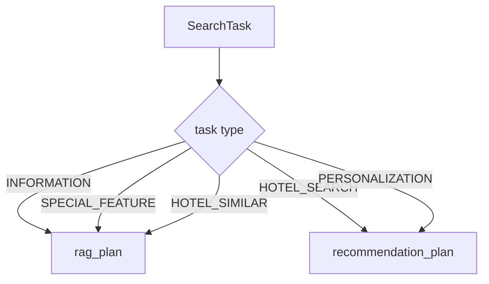

# 07 - Router Contract

## Mục tiêu

Mô tả output cuối của Query Understanding: cách `SearchPlanResult` được chuyển thành `RouterResult`. Tài liệu này dừng ở contract bàn giao cho downstream, không mô tả cách RAG hoặc hotel search thực thi.

## Input của router

```python
Router.run(
    query: str,
    search_plan: SearchPlanResult,
    intent: IntentResult,
    active_profile: ActiveProfile,
    session_context: SessionContext,
    user_id: str,
) -> RouterResult
```

Router không tự gọi retrieval/search. Nó chỉ build kế hoạch thực thi.

## SearchPlanResult

```python
SearchPlanResult(
    execution_mode="parallel",
    search_tasks=[...],
    retrieval_sources=[...],
    graph_operations=[...],
)
```

`search_tasks` là source chính. `retrieval_sources` và `graph_operations` chỉ còn dùng để derive legacy tasks nếu `search_tasks` rỗng.

## RouterResult

```python
RouterResult(
    execution_mode="parallel",
    rag_plan=[...],
    recommendation_plan=[...],
    tool_calls=[],
)
```

Ý nghĩa:

- `rag_plan`: các bước cần factual retrieval / hotel information QA.
- `recommendation_plan`: các bước cần hotel recommendation/search/personalization.
- `tool_calls`: hiện model có field nhưng router runtime hiện không populate trong code path chính.

## Task mapping



| SearchTask | Router output | Source |
| --- | --- | --- |
| `INFORMATION` | `RagExecutionStep` | `RAG_SERVICE` |
| `SPECIAL_FEATURE` | `RagExecutionStep` | `RAG_SERVICE` |
| `HOTEL_SIMILAR` | `RagExecutionStep` | `RAG_SERVICE` |
| `HOTEL_SEARCH` | `ExecutionStep` | `HOTEL_EMBEDDING_DB` |
| `PERSONALIZATION` | `ExecutionStep` | `UNIFIED_GRAPH` + `SIMILAR_USER_SEARCH` |

## RAG step contract

```python
RagExecutionStep(
    step=1,
    intent_type=SearchTask.INFORMATION,
    source="RAG_SERVICE",
    parameters={
        "query": query,
        "features": {
            "hotel_name": "...",
            "destination": "...",
            "amenities": [...],
            "expectations": [...],
        },
    },
)
```

Feature extraction rule:

- `hotel_name`: từ `intent.entities.hotel_name`.
- `hotel_names`: chỉ dùng cho `HOTEL_SIMILAR`.
- `destination`: entity destination, fallback sang `session_context.destination`.
- `amenities`: keys từ `active_profile.long_term_amenities`.
- `expectations`: mapping từ `trip_type` sang expectation token.

## Recommendation step contract

```python
ExecutionStep(
    step=1,
    intent_type=SearchTask.HOTEL_SEARCH,
    source=SearchSource.HOTEL_EMBEDDING_DB,
    parameters={
        "user_id": user_id,
        "active_profile": asdict(active_profile),
        "session_context": {...},
    },
)
```

Với personalization:

```python
ExecutionStep(
    step=1,
    intent_type=SearchTask.PERSONALIZATION,
    source=SearchSource.UNIFIED_GRAPH,
    graph_operation=GraphOperation.SIMILAR_USER_SEARCH,
    parameters={...},
)
```

## Recommendation session_context handoff

Router chỉ truyền phần session context downstream cần:

- `destination`
- `current_location`
- `nearby_place`
- `number_of_guests`
- `has_pet`
- `has_children`
- `check_in`
- `check_out`
- `note_amenities`
- `session_price_range`
- `runtime_tag_expansion`

## Legacy task derivation

Nếu `search_plan.search_tasks` rỗng:

| Legacy signal | Derived SearchTask |
| --- | --- |
| `RAG_SEARCH` in `retrieval_sources` | `INFORMATION` |
| `HOTEL_EMBEDDING_SEARCH` in `retrieval_sources` | `HOTEL_SEARCH` |
| `SIMILAR_USER_SEARCH` in `graph_operations` | `PERSONALIZATION` |
| `HOTEL_SIMILARITY_SEARCH` in `graph_operations` | `HOTEL_SIMILAR` |
| `HOTEL_FEATURE_DISCOVERY` in `graph_operations` | `SPECIAL_FEATURE` |

Router dedupe task theo insertion order.

## Error behavior

Nếu router gặp task không support:

```python
raise ValueError(f"Unsupported search task: {task}")
```

Đây là lỗi contract giữa planner và router. Planner không nên sinh task ngoài enum `SearchTask`.

## Mapping source code

- backend/app/query_understanding/router/router.py
- backend/app/query_understanding/models/router.py
- backend/app/query_understanding/models/planner.py
- backend/app/query_understanding/enums/search_task.py
- backend/app/query_understanding/enums/search_source.py
- backend/app/query_understanding/enums/graph_operation.py
