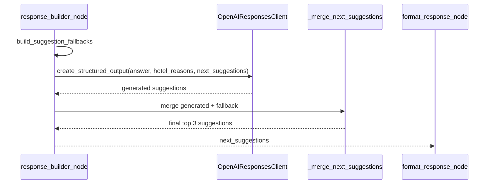
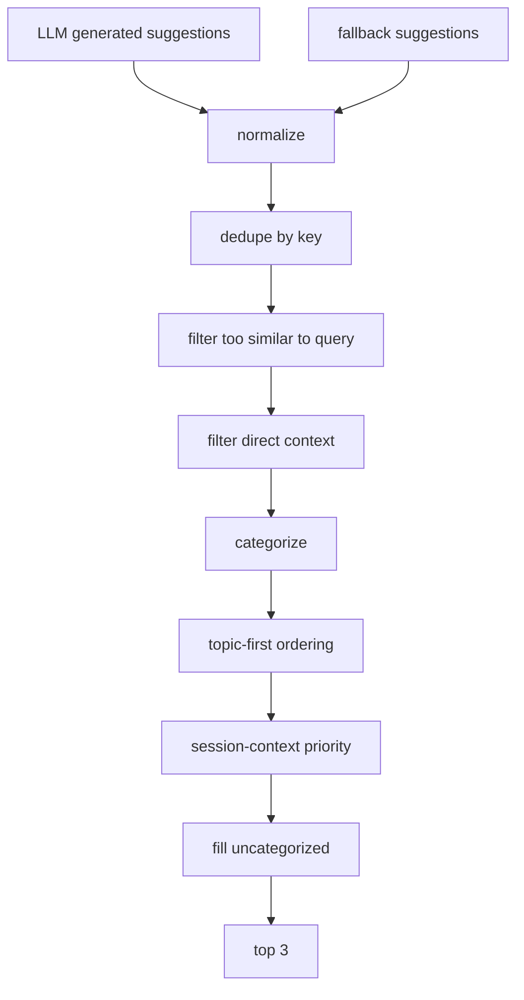

# Next Suggestion Engine

## Mục tiêu

Tài liệu này mô tả riêng logic sinh `next_suggestions`. Phần này nằm ngoài scope Query Understanding trong `INDEX.md`.

`next_suggestions` là danh sách tối đa 3 câu gợi ý tiếp theo để người dùng có thể bấm/gửi lại nguyên văn. Engine ưu tiên câu hỏi OTA rõ nghĩa, có ngữ cảnh trực tiếp, không trùng query hiện tại và không phụ thuộc vào lịch sử hội thoại.

## Vị trí runtime



## Kiến trúc 2 lớp

### Lớp 1: LLM generation

Response builder gọi LLM structured output với schema:

```python
{
    "answer": "string",
    "hotel_reasons": [
        {"hotel_id": "string", "reason": "string"}
    ],
    "next_suggestions": ["string"]
}
```

Yêu cầu với suggestion do LLM sinh:

- Đúng 3 truy vấn OTA bằng tiếng Việt nếu có thể.
- Có thể gửi nguyên văn.
- Không dùng chủ ngữ hội thoại như “Bạn”, “Mình”, “Tôi”, “Anh/chị”.
- Không phải câu hỏi yes/no.
- Phải nhắc lại destination hoặc tên khách sạn liên quan.
- Không tự bịa giá, tiện nghi hoặc dữ kiện chưa có.

### Lớp 2: Rule post-processing

LLM output không được tin tuyệt đối. Rule layer sẽ:

- Chuẩn hóa text.
- Xóa bullet/list marker và prefix hội thoại.
- Dedupe theo normalized key.
- Loại suggestion quá giống query hiện tại.
- Loại suggestion không có direct context.
- Phân loại category.
- Ưu tiên theo topic query.
- Ưu tiên theo session context.
- Fill bằng fallback nếu LLM thiếu hoặc bị lọc.
- Giới hạn tối đa 3 item.

## Thuật toán merge



Pseudo-code:

```python
def _merge_next_suggestions(generated, fallbacks, query, destination, ranked, session_context, limit=3):
    hotel_names = _hotel_names(ranked)
    focus_hotel = _extract_focus_hotel(query, hotel_names)

    for item in [*generated, *fallbacks]:
        text = _normalize_suggestion(item)
        key = _suggestion_dedupe_key(text)

        if not text:
            continue
        if key in seen:
            continue
        if _is_too_similar_to_query(text, query, hotel_names):
            continue
        if not _has_direct_context(text, destination, hotel_names, focus_hotel):
            continue

        category = _suggestion_category(text)
        collect_by_category_or_uncategorized(text, category)

    return ordered_top_3
```

## Normalize suggestion

`_normalize_suggestion` xử lý:

- Strip whitespace.
- Xóa list marker như `1.`, `-`, `•`.
- Xóa prefix hội thoại không cần thiết.
- Chuẩn hóa khoảng trắng.

Mục tiêu: biến output LLM thành câu search/action ngắn gọn.

## Dedupe key

Suggestion được fold text để so trùng:

- lower-case
- bỏ dấu tiếng Việt
- xóa ký tự thừa
- normalize whitespace

Ví dụ:

```text
"Chính sách hủy phòng tại Vinpearl Nha Trang"
"chinh sach huy phong tai vinpearl nha trang"
```

Hai câu trên có cùng dedupe key.

## Similarity filter

Engine loại suggestion quá giống query hiện tại.

Gọi:

- $S$: tập token của suggestion sau normalize.
- $Q$: tập token của query sau normalize.

Overlap:

$$
overlap = |S \cap Q|
$$

Containment:

$$
containment = \frac{|S \cap Q|}{\max(1, \min(|S|, |Q|))}
$$

Jaccard:

$$
jaccard = \frac{|S \cap Q|}{\max(1, |S \cup Q|)}
$$

Suggestion bị loại khi:

- Trùng hoàn toàn sau normalize.
- Một câu là substring dài của câu còn lại.
- Token overlap quá cao theo containment hoặc jaccard.

Mục tiêu: chip gợi ý phải mở ra bước tiếp theo, không lặp lại câu user vừa hỏi.

## Direct context filter

Suggestion phải nhắc lại ít nhất một context trực tiếp:

- destination
- tên hotel trong `ranked_recommendations`
- focus hotel extract từ query

Nếu không có reference nào, filter cho qua.

```python
references = [destination, *hotel_names, focus_hotel]
return any(reference in suggestion for reference in references)
```

Mục tiêu: suggestion có thể gửi độc lập, không cần dựa vào lịch sử chat.

## Query topic

`_query_topic` phân loại query hiện tại để ưu tiên fallback/category:

| Topic | Dấu hiệu |
| --- | --- |
| `policy` | chính sách, hoàn hủy, hoàn tiền, check-in/out, phụ thu |
| `destination_change` | đổi điểm đến, chuyển điểm đến, điểm đến mới |
| `specific_hotel` | query nhắc tên hotel hoặc “khách sạn này/đó” |
| `specific_hotel_amenity` | query nhắc hotel + amenity |
| `default` | exploration thông thường |

## Suggestion category

Suggestion được phân loại để ordering:

- `policy_stay`
- `policy_cancellation`
- `policy_fee`
- `policy_general`
- `hotel_details`
- `room_details`
- `nearby_places`
- `activities`
- `recommendation`
- `amenity_specific`
- `trip_context`

Nếu không match category nào, suggestion đi vào nhóm `uncategorized`.

## Topic-first ordering

Mỗi topic có thứ tự category riêng.

Ví dụ `policy` ưu tiên:

1. `policy_stay`
2. `policy_cancellation`
3. `policy_fee`
4. `policy_general`
5. `hotel_details`
6. `room_details`

Ví dụ `specific_hotel` ưu tiên:

1. `hotel_details`
2. `room_details`
3. `policy_stay`
4. `policy_cancellation`
5. `nearby_places`
6. `activities`

## Session-context priority

Sau topic ordering, engine dùng `session_context` để ưu tiên thêm:

| Context | Ưu tiên category |
| --- | --- |
| family / trẻ em | `amenity_specific`, `activities`, `room_details`, `nearby_places` |
| honeymoon / couple / resort | `amenity_specific`, `room_details`, `activities`, `nearby_places` |
| có amenities hoặc room views | `amenity_specific`, `room_details`, `activities` |
| default | `room_details`, `nearby_places`, `activities` |

## Fallback strategy

Fallback được sinh deterministic để đảm bảo luôn có suggestion tốt khi LLM output bị thiếu/lọc.

### Topic `policy`

Target là focus hotel hoặc destination:

- `Chính sách nhận và trả phòng tại {target}`
- `Chính sách hủy phòng và hoàn tiền tại {target}`
- `Phụ thu trẻ em và giường phụ tại {target}`

### Topic `destination_change`

- `Khu vực nên ở và di chuyển thuận tiện tại {destination}`
- `Tìm khách sạn có bể bơi tại {destination}`
- `Hoạt động vui chơi và ăn uống tại {destination}`

### Topic `specific_hotel`

- `Chi tiết hạng phòng và giá tại {focus_hotel}`
- `Tiện nghi và vị trí của {focus_hotel}`
- `Chính sách nhận và trả phòng tại {focus_hotel}`
- `Địa điểm tham quan và ăn uống gần {destination_or_hotel}`

### Topic `specific_hotel_amenity`

- `Tìm khách sạn có {amenity} tại {destination_or_hotel}`
- `Tiện nghi và loại phòng tại {focus_hotel}`
- `Địa điểm tham quan và ăn uống gần {destination_or_hotel}`
- `Chính sách nhận và trả phòng tại {focus_hotel}`

### Default exploration

Dựa theo context:

- family: khu vui chơi / tiện ích trẻ em
- honeymoon/resort: spa / hồ bơi / cặp đôi
- amenities: amenity nổi bật
- room views: phòng view tương ứng
- hotel names: hạng phòng, địa điểm gần hotel
- destination: địa điểm lân cận, khách sạn có bể bơi, hoạt động ăn uống

## Guardrail policy

Next Suggestion phải tôn trọng guardrail path:

- `OUT_OF_SCOPE`: `next_suggestions = []`
- `ASSISTANT_HELP` với `NO_HISTORY` hoặc `NONE`: `next_suggestions = []`

Guardrail response path không nên render suggestion hành động vì user không đang ở trong flow OTA search/recommendation hợp lệ.

## Budget explanation liên quan

Response builder cũng tạo budget explanation từ `session_context`.

Nếu `budget_type = total` và có số đêm:

$$
per\_night = \frac{raw\_budget}{number\_of\_nights}
$$

Answer sẽ diễn đạt budget total thành mức tương đương mỗi đêm.

Nếu `budget_type = per_night`, answer diễn đạt trực tiếp là ngân sách mỗi đêm.

Phần này ảnh hưởng answer, không trực tiếp quyết định suggestion ordering.

## Output contract

```python
{
    "synthesized_answer": "...",
    "hotel_reasons": {"hotel_id": "reason"},
    "next_suggestions": [
        "Chi tiết hạng phòng và giá tại Vinpearl Nha Trang",
        "Chính sách hủy phòng và hoàn tiền tại Vinpearl Nha Trang",
        "Hoạt động vui chơi và ăn uống tại Nha Trang",
    ],
}
```

Ràng buộc:

- list string
- tối đa 3 item
- có thể empty với guardrail path
- mỗi item nên độc lập, rõ nghĩa, gửi lại được

## Debug checklist

Khi suggestion xấu hoặc rỗng bất thường, kiểm tra theo thứ tự:

1. `generated` từ LLM có hợp lệ không.
2. `suggestion_fallbacks` có được sinh không.
3. Query topic có bị phân loại sai không.
4. `_is_too_similar_to_query` có lọc quá tay không.
5. `_has_direct_context` có thiếu destination/hotel_names không.
6. `ranked_recommendations` có hotel names không.
7. `session_context` có dạng dict score map đúng không.
8. Guardrail category có ép empty list không.

## Mapping source code

- backend/app/agent/response_builder.py
- backend/app/agent/nodes.py
