# Chi Tiết Schema Cơ Sở Dữ Liệu Quan Hệ (PostgreSQL)

Tài liệu này định nghĩa chi tiết các bảng trong cơ sở dữ liệu quan hệ PostgreSQL (Supabase) phục vụ lưu trữ dữ liệu du lịch OTA được chuẩn hóa từ các tệp tin JSON crawl được.

Schema gồm **15 bảng** trong schema `public`, chia thành 4 nhóm:

- **Lõi**: `hotels`, `rooms`, `activities`, `nearby_places`
- **Tiện ích (chuẩn hóa)**: `amenity_categories`, `amenities`, `hotel_amenities`
- **Thông tin bổ sung khách sạn**: `hotel_images`, `hotel_policies`, `hotel_suitability`, `place_categories`
- **Đánh giá & RAG**: `reviews`, `review_grades`, `review_aspects`, `text_chunks`

---

## 1. Sơ Đồ Thực Thể Liên Kết (ER Diagram)

```mermaid
erDiagram
    HOTELS ||--o{ ROOMS : "has"
    HOTELS ||--o{ ACTIVITIES : "has"
    HOTELS ||--o{ NEARBY_PLACES : "has"
    HOTELS ||--o{ HOTEL_IMAGES : "has"
    HOTELS ||--|| HOTEL_POLICIES : "has"
    HOTELS ||--o{ HOTEL_SUITABILITY : "has"
    HOTELS ||--o{ HOTEL_AMENITIES : "has"
    HOTELS ||--o{ REVIEWS : "has"
    HOTELS ||--o{ REVIEW_GRADES : "has"
    HOTELS ||--o{ REVIEW_ASPECTS : "has"
    HOTELS ||--o{ TEXT_CHUNKS : "has"
    AMENITIES ||--o{ HOTEL_AMENITIES : "linked"
    AMENITY_CATEGORIES ||--o{ AMENITIES : "groups"
    PLACE_CATEGORIES ||--o{ NEARBY_PLACES : "groups"

    HOTELS {
        integer id PK "hotel_id từ nguồn"
        varchar name "NOT NULL"
        varchar property_type
        varchar accommodation_type
        numeric star_rating "3,1"
        boolean is_luxury "DEFAULT FALSE"
        numeric review_score "3,1"
        integer review_count "DEFAULT 0"
        text address
        varchar city
        integer city_id
        varchar area
        varchar country
        double latitude
        double longitude
        text description
        text source_url
    }

    ROOMS {
        serial id PK
        integer hotel_id FK
        bigint room_type_id
        varchar name "NOT NULL"
        numeric price "VND 15,2"
        varchar room_size
        integer max_occupancy
        varchar bed_type
        varchar room_view
        text_arr room_amenities "TEXT[]"
        text_arr images "TEXT[]"
        numeric review_score "3,1"
    }

    ACTIVITIES {
        serial id PK
        integer hotel_id FK
        bigint activity_id
        varchar title "NOT NULL"
        text description
        numeric price_amount "VND 15,2"
        numeric review_score "3,1"
    }

    NEARBY_PLACES {
        serial id PK
        integer hotel_id FK
        varchar name "NOT NULL"
        varchar type
        integer category_id FK
        numeric distance_km "6,2"
    }

    PLACE_CATEGORIES {
        serial id PK
        varchar name "NOT NULL"
    }

    AMENITY_CATEGORIES {
        serial id PK
        varchar name "NOT NULL"
    }

    AMENITIES {
        serial id PK
        varchar name "NOT NULL"
        varchar category
        integer category_id FK
    }

    HOTEL_AMENITIES {
        integer hotel_id FK
        integer amenity_id FK
    }

    HOTEL_IMAGES {
        serial id PK
        integer hotel_id FK
        text url "NOT NULL"
        boolean is_primary "DEFAULT FALSE"
    }

    HOTEL_POLICIES {
        integer hotel_id PK "FK 1-1"
        time check_in_from
        time check_out_until
        numeric service_fee_pct "5,2"
        text child_policy
        text pet_policy
        boolean deposit_required
        text_arr policy_notes "TEXT[]"
    }

    HOTEL_SUITABILITY {
        serial id PK
        integer hotel_id FK
        varchar suitable_for_tag
        integer mention_count
        numeric score "4,2"
    }

    REVIEWS {
        serial id PK
        integer hotel_id FK
        varchar reviewer_name
        varchar reviewer_country
        numeric rating "3,1"
        date review_date
        text title
        text text
        text positive_text
        text negative_text
    }

    REVIEW_GRADES {
        serial id PK
        integer hotel_id FK
        varchar grade_name
        numeric grade_score "3,1"
    }

    REVIEW_ASPECTS {
        serial id PK
        integer hotel_id FK
        varchar aspect_name
        integer mentioned
        numeric positive_pct "5,2"
    }

    TEXT_CHUNKS {
        serial id PK
        integer hotel_id FK
        varchar chunk_type
        text content
        vector embedding
        jsonb metadata
        timestamptz created_at
    }
```

---

## 2. Chi Tiết Các Bảng Dữ Liệu

### 2.1. Bảng `hotels` (Thông tin Khách sạn)
Bảng lõi, lưu thông tin cơ bản và định vị địa lý của khách sạn. `id` lấy trực tiếp từ ID nguồn (không tự sinh).

| Tên cột | Kiểu dữ liệu | Ràng buộc | Mô tả |
| :--- | :--- | :--- | :--- |
| `id` | `INTEGER` | PRIMARY KEY | ID duy nhất của khách sạn (từ nguồn crawl) |
| `name` | `VARCHAR(255)` | NOT NULL | Tên khách sạn (kèm tên tiếng Anh trong ngoặc) |
| `property_type` | `VARCHAR(100)` | | Loại hình bất động sản (e.g., Hotel) |
| `accommodation_type` | `VARCHAR(100)` | | Loại chỗ ở (e.g., Resort, Khách sạn, Homestay) |
| `star_rating` | `NUMERIC(3,1)` | | Số sao (e.g., 5.0, 3.0) |
| `is_luxury` | `BOOLEAN` | DEFAULT FALSE | Phân loại phân khúc cao cấp/sang trọng |
| `review_score` | `NUMERIC(3,1)` | | Điểm đánh giá trung bình (e.g., 9.0, 8.8) |
| `review_count` | `INTEGER` | DEFAULT 0 | Số lượng nhận xét |
| `address` | `TEXT` | | Địa chỉ chi tiết đầy đủ |
| `city` | `VARCHAR(100)` | | Thành phố/Khu vực chính (e.g., Hạ Long, Đảo Phú Quốc) |
| `city_id` | `INTEGER` | NULLABLE | Mã thành phố từ nguồn (có thể `NULL`) |
| `area` | `VARCHAR(150)` | | Khu vực/phường chi tiết (e.g., Cảng Hòn Gai, Dương Đông) |
| `country` | `VARCHAR(100)` | | Quốc gia (e.g., Việt Nam) |
| `latitude` | `DOUBLE PRECISION` | | Vĩ độ phục vụ định vị địa lý |
| `longitude` | `DOUBLE PRECISION` | | Kinh độ phục vụ định vị địa lý |
| `description` | `TEXT` | | Bài viết mô tả chi tiết khách sạn |
| `source_url` | `TEXT` | | Đường dẫn trang nguồn crawl dữ liệu |

> **Lưu ý thay đổi schema:** Các mảng tiện ích, ảnh, chính sách, đối tượng phù hợp, review chi tiết — vốn nằm trực tiếp trong `hotels` ở phiên bản cũ — nay đã được **chuẩn hóa** ra các bảng riêng (xem bên dưới).

### 2.2. Bảng `rooms` (Thông tin Phòng)
Lưu thông tin chi tiết của từng loại phòng trực thuộc khách sạn.

| Tên cột | Kiểu dữ liệu | Ràng buộc | Mô tả |
| :--- | :--- | :--- | :--- |
| `id` | `SERIAL` | PRIMARY KEY | ID tự sinh cho mỗi loại phòng |
| `hotel_id` | `INTEGER` | REFERENCES `hotels(id)` | Khách sạn sở hữu phòng này |
| `room_type_id` | `BIGINT` | | ID loại phòng gốc từ nguồn |
| `name` | `VARCHAR(255)` | NOT NULL | Tên loại phòng |
| `price` | `NUMERIC(15,2)` | | Giá phòng (đơn vị VND) |
| `room_size` | `VARCHAR(50)` | | Kích thước phòng hiển thị (e.g., "38 m²") |
| `max_occupancy` | `INTEGER` | | Số người tối đa được ở |
| `bed_type` | `VARCHAR(255)` | | Mô tả loại giường (e.g., 1 giường lớn) |
| `room_view` | `VARCHAR(100)` | | Hướng phòng (e.g., Hướng Biển, Hướng Vườn) |
| `room_amenities` | `TEXT[]` | | Mảng tiện ích phòng chi tiết |
| `images` | `TEXT[]` | | Danh sách URL ảnh phòng |
| `review_score` | `NUMERIC(3,1)` | | Điểm đánh giá riêng cho loại phòng |

### 2.3. Bảng `activities` (Hoạt động Giải trí / Vé vui chơi)
Lưu thông tin hoạt động vui chơi để phục vụ tạo gói combo.

| Tên cột | Kiểu dữ liệu | Ràng buộc | Mô tả |
| :--- | :--- | :--- | :--- |
| `id` | `SERIAL` | PRIMARY KEY | ID tự sinh |
| `hotel_id` | `INTEGER` | REFERENCES `hotels(id)` | Khách sạn liên kết với hoạt động |
| `activity_id` | `BIGINT` | | ID hoạt động/vé gốc từ nguồn |
| `title` | `VARCHAR(255)` | NOT NULL | Tên vé/hoạt động giải trí |
| `description` | `TEXT` | | Mô tả chi tiết hoạt động |
| `price_amount` | `NUMERIC(15,2)` | | Giá vé vui chơi (VND) |
| `review_score` | `NUMERIC(3,1)` | | Điểm đánh giá hoạt động |

### 2.4. Bảng `nearby_places` (Địa điểm Lân cận)
Lưu các địa danh nổi tiếng gần khách sạn, liên kết tới `place_categories`.

| Tên cột | Kiểu dữ liệu | Ràng buộc | Mô tả |
| :--- | :--- | :--- | :--- |
| `id` | `SERIAL` | PRIMARY KEY | ID tự sinh |
| `hotel_id` | `INTEGER` | REFERENCES `hotels(id)` | Khách sạn liên kết |
| `name` | `VARCHAR(255)` | NOT NULL | Tên địa danh (e.g., Bến tàu du lịch Bãi Cháy) |
| `type` | `VARCHAR(100)` | | Tên phân loại (dạng text, e.g., Bến Cảng và Bến Đò) |
| `category_id` | `INTEGER` | REFERENCES `place_categories(id)` | Mã phân loại địa điểm (chuẩn hóa) |
| `distance_km` | `NUMERIC(6,2)` | | Khoảng cách thực tế (km) |

### 2.5. Bảng `place_categories` (Danh mục Địa điểm)
Bảng tra cứu phân loại địa điểm lân cận.

| Tên cột | Kiểu dữ liệu | Ràng buộc | Mô tả |
| :--- | :--- | :--- | :--- |
| `id` | `SERIAL` | PRIMARY KEY | ID tự sinh |
| `name` | `VARCHAR(100)` | NOT NULL | Tên danh mục (e.g., Đảo, Bến Cảng và Bến Đò) |

---

## 3. Nhóm Tiện Ích (Chuẩn hóa)

### 3.1. Bảng `amenity_categories` (Danh mục Tiện ích)
Bảng tra cứu nhóm tiện ích.

| Tên cột | Kiểu dữ liệu | Ràng buộc | Mô tả |
| :--- | :--- | :--- | :--- |
| `id` | `SERIAL` | PRIMARY KEY | ID tự sinh |
| `name` | `VARCHAR(100)` | NOT NULL | Tên nhóm (e.g., Truy cập Internet, Ăn uống) |

### 3.2. Bảng `amenities` (Tiện ích)
Danh mục tiện ích dùng chung cho mọi khách sạn.

| Tên cột | Kiểu dữ liệu | Ràng buộc | Mô tả |
| :--- | :--- | :--- | :--- |
| `id` | `SERIAL` | PRIMARY KEY | ID tự sinh |
| `name` | `VARCHAR(255)` | NOT NULL | Tên tiện ích (e.g., Bàn tiếp tân 24 giờ) |
| `category` | `VARCHAR(100)` | | Tên nhóm (dạng text, denormalized) |
| `category_id` | `INTEGER` | REFERENCES `amenity_categories(id)` | Mã nhóm tiện ích (chuẩn hóa) |

### 3.3. Bảng `hotel_amenities` (Bảng nối Khách sạn ↔ Tiện ích)
Bảng trung gian quan hệ nhiều-nhiều giữa `hotels` và `amenities`.

| Tên cột | Kiểu dữ liệu | Ràng buộc | Mô tả |
| :--- | :--- | :--- | :--- |
| `hotel_id` | `INTEGER` | REFERENCES `hotels(id)` | Khóa ngoại đến khách sạn |
| `amenity_id` | `INTEGER` | REFERENCES `amenities(id)` | Khóa ngoại đến tiện ích |

> Khóa chính tổ hợp `(hotel_id, amenity_id)`.

---

## 4. Nhóm Thông Tin Bổ Sung Khách Sạn

### 4.1. Bảng `hotel_images` (Ảnh Khách sạn)
Danh sách ảnh của khách sạn (tách từ mảng `images` cũ).

| Tên cột | Kiểu dữ liệu | Ràng buộc | Mô tả |
| :--- | :--- | :--- | :--- |
| `id` | `SERIAL` | PRIMARY KEY | ID tự sinh |
| `hotel_id` | `INTEGER` | REFERENCES `hotels(id)` | Khách sạn sở hữu ảnh |
| `url` | `TEXT` | NOT NULL | Đường dẫn URL ảnh |
| `is_primary` | `BOOLEAN` | DEFAULT FALSE | Cờ đánh dấu ảnh đại diện chính |

### 4.2. Bảng `hotel_policies` (Chính sách Khách sạn)
Thông tin chính sách & nhận/trả phòng (quan hệ 1-1 với khách sạn).

| Tên cột | Kiểu dữ liệu | Ràng buộc | Mô tả |
| :--- | :--- | :--- | :--- |
| `hotel_id` | `INTEGER` | PRIMARY KEY, REFERENCES `hotels(id)` | Khóa chính kiêm khóa ngoại (1-1) |
| `check_in_from` | `TIME` | | Giờ nhận phòng sớm nhất (e.g., 15:00) |
| `check_out_until` | `TIME` | | Giờ trả phòng muộn nhất (e.g., 12:00) |
| `service_fee_pct` | `NUMERIC(5,2)` | | Phí dịch vụ tính theo % (e.g., 5.00) |
| `child_policy` | `TEXT` | | Chính sách trẻ em |
| `pet_policy` | `TEXT` | | Chính sách vật nuôi |
| `deposit_required` | `BOOLEAN` | | Yêu cầu đặt cọc hay không |
| `policy_notes` | `TEXT[]` | | Mảng các ghi chú/chính sách đặc biệt khác |

### 4.3. Bảng `hotel_suitability` (Đối tượng Phù hợp)
Đối tượng khách phù hợp kèm số lần nhắc đến và điểm số (tách từ `suitable_for` cũ).

| Tên cột | Kiểu dữ liệu | Ràng buộc | Mô tả |
| :--- | :--- | :--- | :--- |
| `id` | `SERIAL` | PRIMARY KEY | ID tự sinh |
| `hotel_id` | `INTEGER` | REFERENCES `hotels(id)` | Khách sạn liên kết |
| `suitable_for_tag` | `VARCHAR(150)` | | Nhãn đối tượng (e.g., Gia đình có thanh thiếu niên) |
| `mention_count` | `INTEGER` | | Số lần được nhắc đến trong đánh giá |
| `score` | `NUMERIC(4,2)` | | Điểm mức độ phù hợp (e.g., 9.20) |

---

## 5. Nhóm Đánh Giá & RAG

### 5.1. Bảng `reviews` (Nhận xét chi tiết)
Lưu từng nhận xét của khách (tách từ `reviews_detail` cũ).

| Tên cột | Kiểu dữ liệu | Ràng buộc | Mô tả |
| :--- | :--- | :--- | :--- |
| `id` | `SERIAL` | PRIMARY KEY | ID tự sinh |
| `hotel_id` | `INTEGER` | REFERENCES `hotels(id)` | Khách sạn được đánh giá |
| `reviewer_name` | `VARCHAR(255)` | | Tên người đánh giá |
| `reviewer_country` | `VARCHAR(100)` | | Quốc gia người đánh giá |
| `rating` | `NUMERIC(3,1)` | | Điểm đánh giá (e.g., 10.0, 9.0) |
| `review_date` | `DATE` | NULLABLE | Ngày đánh giá (có thể `NULL`) |
| `title` | `TEXT` | | Tiêu đề nhận xét |
| `text` | `TEXT` | | Nội dung nhận xét đầy đủ |
| `positive_text` | `TEXT` | | Phần nội dung tích cực |
| `negative_text` | `TEXT` | | Phần nội dung tiêu cực |

### 5.2. Bảng `review_grades` (Điểm theo Tiêu chí)
Điểm số chi tiết theo từng tiêu chí (tách từ `grades` cũ).

| Tên cột | Kiểu dữ liệu | Ràng buộc | Mô tả |
| :--- | :--- | :--- | :--- |
| `id` | `SERIAL` | PRIMARY KEY | ID tự sinh |
| `hotel_id` | `INTEGER` | REFERENCES `hotels(id)` | Khách sạn liên kết |
| `grade_name` | `VARCHAR(150)` | | Tên tiêu chí (e.g., Độ sạch sẽ) |
| `grade_score` | `NUMERIC(3,1)` | | Điểm của tiêu chí (e.g., 9.4) |

### 5.3. Bảng `review_aspects` (Khía cạnh Đánh giá)
Thống kê các khía cạnh được nhắc đến trong đánh giá và tỷ lệ tích cực.

| Tên cột | Kiểu dữ liệu | Ràng buộc | Mô tả |
| :--- | :--- | :--- | :--- |
| `id` | `SERIAL` | PRIMARY KEY | ID tự sinh |
| `hotel_id` | `INTEGER` | REFERENCES `hotels(id)` | Khách sạn liên kết |
| `aspect_name` | `VARCHAR(150)` | | Tên khía cạnh (e.g., Dịch vụ, Bữa sáng) |
| `mentioned` | `INTEGER` | | Số lần được nhắc đến |
| `positive_pct` | `NUMERIC(5,2)` | | Tỷ lệ % nhận xét tích cực (e.g., 74.00) |

### 5.4. Bảng `text_chunks` (Đoạn văn bản cho RAG)
Lưu các đoạn văn bản đã chunk kèm vector embedding phục vụ semantic search (RAG). Yêu cầu extension `pgvector`.

| Tên cột | Kiểu dữ liệu | Ràng buộc | Mô tả |
| :--- | :--- | :--- | :--- |
| `id` | `SERIAL` | PRIMARY KEY | ID tự sinh |
| `hotel_id` | `INTEGER` | REFERENCES `hotels(id)` | Khách sạn nguồn của đoạn văn bản |
| `chunk_type` | `VARCHAR(50)` | | Loại chunk (e.g., description, review, amenity) |
| `content` | `TEXT` | | Nội dung văn bản gốc của chunk |
| `embedding` | `VECTOR` | | Vector embedding (pgvector) phục vụ tìm kiếm ngữ nghĩa |
| `metadata` | `JSONB` | | Metadata bổ sung linh hoạt cho chunk |
| `created_at` | `TIMESTAMPTZ` | | Thời điểm tạo chunk |

---

## 6. Ghi Chú Triển Khai

- Nguồn dữ liệu: dump `local/data/data.sql` (PostgreSQL 17.6, Supabase, định dạng `COPY ... FROM stdin`, **data-only** — không kèm `CREATE TABLE`). Kiểu dữ liệu trong tài liệu này được suy luận từ dữ liệu mẫu.
- Các cột kiểu mảng (`TEXT[]`) trong dump được biểu diễn theo cú pháp array literal của PostgreSQL: `{"phần tử 1","phần tử 2",...}`.
- Giá trị `\N` trong dump tương ứng `NULL` (ví dụ `hotels.city_id`, `reviews.review_date`).
- Đơn vị tiền tệ cho `rooms.price` và `activities.price_amount` là **VND**.
- Các bảng có `SERIAL`/sequence: `rooms`, `activities`, `amenities`, `amenity_categories`, `hotel_images`, `hotel_suitability`, `nearby_places`, `place_categories`, `review_aspects`, `review_grades`, `reviews`, `text_chunks`. Bảng `hotels` dùng `id` từ nguồn (không tự sinh); `hotel_amenities` và `hotel_policies` không có sequence riêng.
